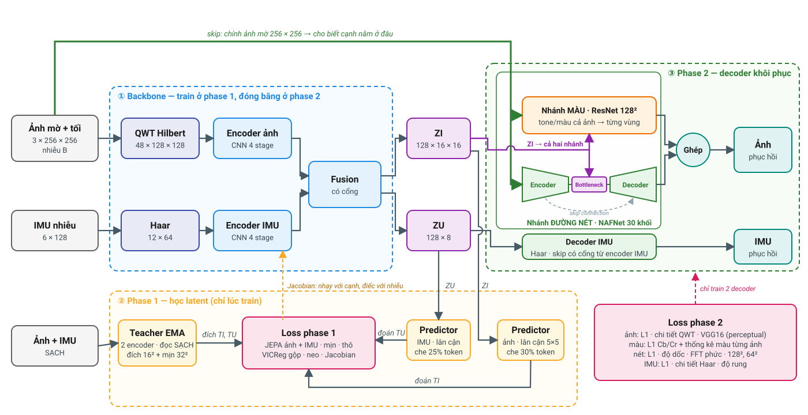

# Sơ đồ kiến trúc QWT–JEPA

Kiến trúc hiện tại là recipe **p15** (`configs/pipeline_v3.yaml`). **Đọc theo ba vùng màu:**

1. **① Backbone (xanh dương).** Ảnh mờ + tối (nhiễu B) đi qua **QWT Hilbert**, IMU nhiễu đi qua
   **Haar**. Mỗi bên có một encoder CNN 4 stage. Fusion có cổng trộn hai bên thành latent **ZI**
   (ảnh, 128 × 16 × 16) và **ZU** (IMU, 128 × 8). Train ở phase 1, đóng băng ở phase 2.
2. **② Phase 1 (vàng, chỉ lúc train).** Teacher EMA (bản sao của hai encoder, m tới 0,9995) đọc
   bản **sạch** và cho ra đích **TI** (16×16, kèm đích **mịn** 32×32) và **TU**. Hai predictor
   riêng — ZI → TI, ZU → TU — **nhìn lân cận** (ảnh 5×5 token), và một phần token bị **che** (ảnh
   30%, IMU 25%) phải đoán từ lân cận. Loss JEPA (cộng đích mịn và đích thô 8×8), VICReg với
   covariance **gộp**, decoder neo và **Jacobian** train backbone; Jacobian ép encoder nhạy với
   đường nét và bỏ qua nhiễu.
3. **③ Phase 2 (xanh lá).** Backbone **đóng băng**. Decoder ảnh nhận ZI và **chính ảnh mờ**
   (mũi tên skip), gồm hai nhánh rồi **ghép**:
   - Nhánh **màu** ở 128×128: một đường cong tone + ma trận màu **cho cả ảnh** (gỡ gamma, cân bằng
     trắng), rồi ResNet 6 khối sửa màu từng vùng.
   - Nhánh **đường nét** (kênh sáng Y, 256×256) là **NAFNet** — U-Net 5 tầng, 30 NAFBlock
     (LayerNorm, conv depthwise, SimpleGate, channel attention). **Encoder** thu nhỏ ÷2 mỗi tầng,
     từ **đặc trưng nhỏ** (cạnh, vật nhỏ — tầng 256² có 48 kênh × 3 + 3 khối) tới **đặc trưng
     tổng thể** (bố cục, vật là gì); **Bottleneck** 16×16 nhận **ZI** (8 khối); **Decoder** phóng
     ×2 trở lại; **skip connection** cộng đặc trưng nhỏ từ Encoder sang Decoder; hai đầu phụ ở
     128² và 64² được chấm riêng.
   - **CNN làm nét + mượt** (p15) chạy sau NAFNet, chỉ trên bản đồ chi tiết Y — màu đã tách riêng
     nên nó không chạm được màu: 4 khối residual × 32 kênh ở 256², không thu nhỏ. Số hạng **gồ ghề
     thừa** ép nó mượt: phạt độ dốc vượt ảnh sạch ở vùng phẳng (hạt, vòng sáng, vệt mờ loang).

   Decoder IMU (hệ số Haar, skip có cổng từ encoder IMU) nhận ZU. **Loss phase 2** chỉ train hai
   decoder này.

| | Phase 1 | Phase 2 |
|---|---|---|
| Train | backbone 1,33 M (+ 2 predictor 0,24 M và decoder neo 1,86 M, bỏ sau phase 1) | decoder ảnh 3,42 M (màu 0,16 M + NAFNet 3,18 M + CNN làm nét 0,08 M) + decoder IMU 0,36 M |
| Loss | JEPA 1,0 (+ mịn 0,5, thô 0,25) · VICReg (covariance gộp) · decoder neo 0,45 · Jacobian 0,05 | ảnh: L1 · chi tiết QWT 2,0 · năng lượng 1,0 · VGG16 perceptual 0,05 · màu: L1 + thống kê màu 1,0 · nét: L1 · độ dốc 1,0 · FFT phức 1,0 · nhiều tỉ lệ 0,5 · gồ ghề thừa 2,0 · L1 đầu ra NAFNet 0,5 · IMU: SmoothL1 · chi tiết Haar · độ rung 2,0 |
| Dữ liệu | nhiễu B: ít mờ, ít hạt; 10% frame chỉ nhiễu, 10% chỉ tối | như phase 1 |

Chi tiết từng lớp: [README](README.md#kiến-trúc-chi-tiết). Vẽ lại hình:
`python3 tools/draw_architecture.py docs/kien_truc.svg`.
