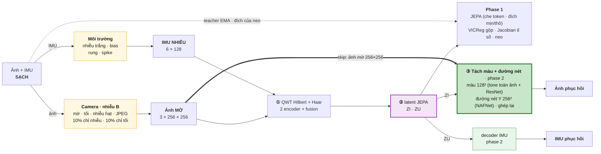
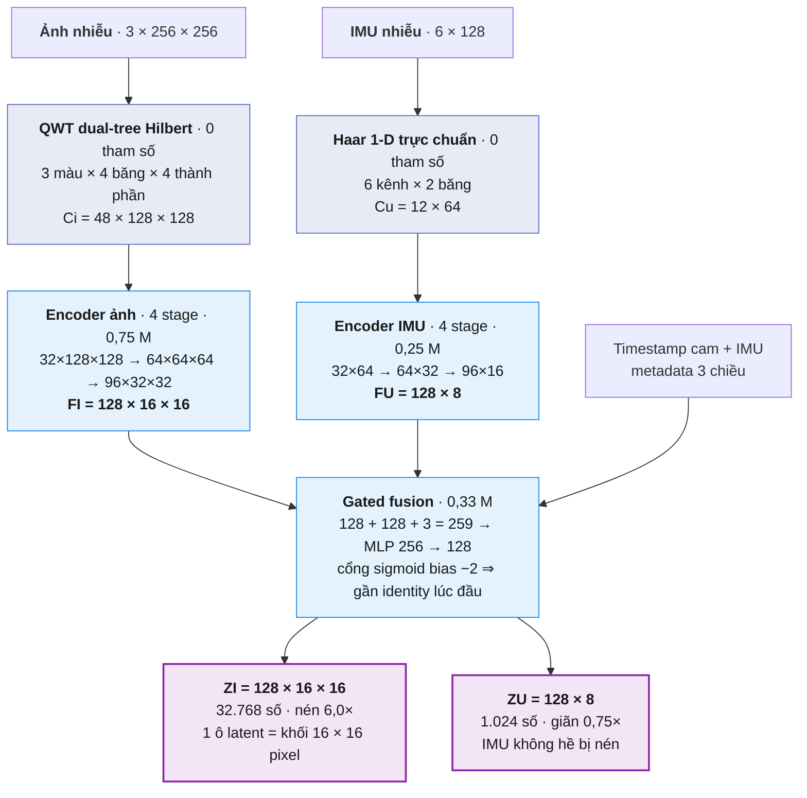
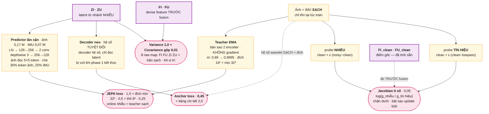
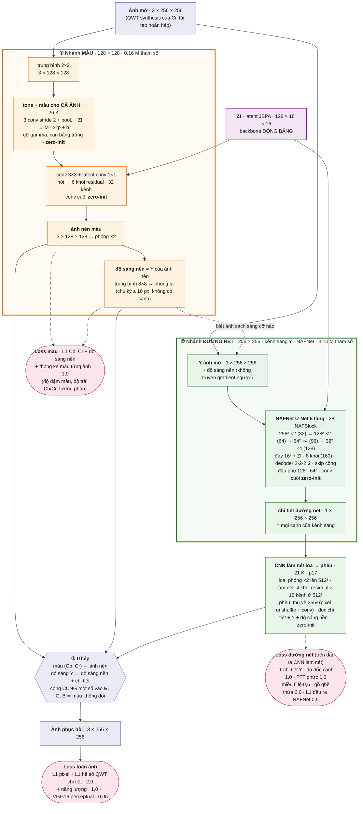
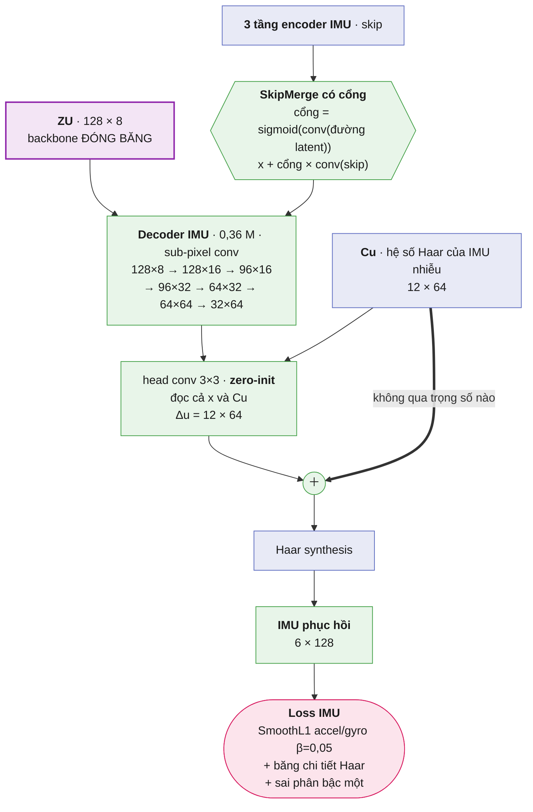

# QWT–JEPA v3 cho ảnh thiếu sáng, mờ và IMU nhiễu

Source: [leesanghyoek/qwt_jepa_ver5](https://github.com/leesanghyoek/qwt_jepa_ver5),
nhánh `main`. Trên Kaggle dùng notebook
[`qwt-jaco-jepa-ver5.ipynb`](qwt-jaco-jepa-ver5.ipynb): Cell 1 clone source và ghim
commit, rồi chạy lần lượt các cell.

Pipeline hai giai đoạn. **Phase 1**: JEPA học latent — encoder đọc ảnh + IMU
**nhiễu** và học dự đoán latent mà teacher EMA tạo từ bản **sạch**, kèm
variance/covariance chống collapse, một decoder neo và số hạng Jacobian. **Phase 2**:
backbone đóng băng, chỉ train decoder khôi phục — cho ảnh là decoder **tách màu và
đường nét** (màu ở 128×128, đường nét trên kênh sáng Y ở 256×256, rồi ghép lại), cho
IMU là decoder hệ số Haar.

**p34_chroma — phase 2: màu ở độ phân giải đầy đủ** (config `configs/kaggle_chroma.yaml` → OUT `outputs/p34_chroma`).
Bằng p33_halo cộng `phase2.split_chroma_*`; hash phase 1 bằng p33 nên **dùng lại phase 1 của p33**, chỉ train phase 2.
- **Đo trên p33** (`tools/halo_probe.py`, 256 ảnh valid, mỗi ảnh có và không có lớp lóe, mọi nhiễu khác giữ nguyên):
  lóe được gỡ phần lớn — ánh sáng lóe còn lại 19% trong vùng lóe (lóe mạnh 17%, nhẹ 27%), lóe làm mất 15,61 dB ở ảnh
  vào và 4,18 dB ở ảnh khôi phục. Nhưng bản **không lóe** — chỉ còn mờ nhẹ và hạt, vì frame có lóe bỏ bước môi trường —
  vào 36,71 dB, ra **27,85 dB**: model làm hỏng ảnh tốt ~9 dB (p31 cũng vậy: blur_only 33,8 → 26,6 dB).
- **Một nguyên nhân nằm trong kiến trúc.** `compose` lấy **màu** của ảnh ra chỉ từ nhánh màu, ở lưới 1/`color_scale`
  (128×128); độ sáng thì đủ 256². Trên 120 ảnh TartanAir sạch, ghép đúng từng phần của chính ảnh sạch qua nút thắt đó
  (model hoàn hảo) chỉ đạt **33,0 dB** (p10 31,7, p90 34,7; `color_scale` 4: 29,2 dB). Và ở update 0 decoder không phải
  phép đồng nhất như bất biến thiết kế đòi: trên decoder p33 thật, đầu ra so với đầu vào 32,6 dB, lệch tới 0,46 ở cạnh
  màu (độ sáng thì đúng).
- **`decoders.ChromaDetail`** (`phase2.split_chroma_detail`): đọc chi tiết màu của chính ảnh J sau tầng tone — Cb, Cr
  của J trừ Cb, Cr của phần lưới màu giữ được — cùng Y và màu thô, ra chi tiết đó cộng một hiệu chỉnh (3 khối residual
  16 kênh ở 256², lớp cuối khởi tạo 0). Cộng vào ảnh ra qua `color_edge.chroma_to_rgb`, một độ lệch RGB có độ sáng bằng 0:
  độ lệch RGB nào cũng đúng bằng độ sáng của nó trên ba kênh cộng `chroma_to_rgb` của màu nó. Ở update 0 đầu ra đúng
  bằng đầu vào (94 dB, sai số float); 14 946 tham số. Thiếu khoá: decoder y như p33, checkpoint p33 nạp được.
- **`halo_probe` có thêm bảng PSNR qua từng tầng** trên cả hai bản: ảnh vào, decoder để nguyên (đầu ra lúc chưa học gì),
  sau bản đồ stop (dựng lại từ `image_stops` như `RelightStops`), sau lưới song phương (J), khôi phục; mỗi tầng có PSNR cả
  ảnh, tần thấp (trung bình khối 8×8, mức tầng tone được giám sát), tần cao (phần còn lại) và Y. Chạy được trên p33.
  **p33, bản không lóe (ảnh tốt):** vào 36,71 dB (Y 38,65) → decoder để nguyên 33,06 → **sau tầng tone 30,20** → khôi phục
  27,85 (Y 29,33). Tầng tone làm mất 6,5 dB trên ảnh không cần chỉnh sáng, và hỏng chủ yếu ở độ sáng (Y). Cột tần
  thấp / tần cao (bản probe mới) sẽ cho biết đó là đổi độ sáng theo vùng hay thêm vết, quầng.
- Đọc kết quả p34: bảng *PSNR qua từng tầng*, dòng "không lóe": "khôi phục" phải gần "vào" hơn p33 (27,85 so với 36,71).
- **Xem ảnh HALO** (`tools/random_pair_preview.py --halo`, Cell 12b `PREVIEW_HALO`): `flare` chỉ lấy ảnh có lóe HALO,
  lớp lóe từ các scene HALO dành riêng cho split (model chưa thấy); `scenes` lấy ảnh gốc của HALO, `flare.png` vào và
  `gt.png` là đích, cắt giữa và thu nhỏ như frame TartanAir. Nguồn sáng ở trong khung, cảnh Blender model chưa từng
  thấy; HALO không có IMU nên mỗi panel mượn IMU của một mẫu TartanAir. Bằng chứng: `tests/test_random_pair_preview.py`.
- Bằng chứng: `tests/test_chroma_detail.py` (độ lệch RGB = độ sáng + màu, `chroma_to_rgb` không mang độ sáng; trên ảnh
  có cạnh màu mịn, lưới màu chặn trần còn cộng chi tiết màu của chính ảnh trả lại đúng ảnh; có khoá thì decoder khởi đầu
  đúng là phép đồng nhất, không có thì màu bị mờ từ update 0; hiệu chỉnh bằng 0 lúc đầu; thiếu khoá giữ đúng các lớp của
  p33; giá trị sai bị từ chối; phase 2 train được và hiệu chỉnh có thay đổi; `halo_probe` thấy decoder để nguyên bằng ảnh
  vào; p34 = p33 + các khoá chroma, cùng hash phase 1).

**p33_halo — nhiễu: lóe sáng thật của HALO cộng lên ảnh TartanAir** (config `configs/kaggle_halo.yaml` → OUT
`outputs/p33_halo`). Bằng p32_relight cộng các khoá `corruption.image.halo_*` và `data.halo_root`; kiến trúc giữ nguyên.
Người dùng: "trộn thêm ảnh HALO vào để model khử được nhiễu và lóe sáng", "tăng xác suất để trong batch có ảnh HALO".
- **Vì sao không thêm ảnh HALO thành sample.** HALO (render Blender, đi kèm UniSER, CVPR 2026) có bộ ba ảnh sạch / có
  lóe / **chỉ lớp lóe**, nhưng không có IMU. Ghép IMU ngẫu nhiên thì dạy model nối hai tín hiệu không liên quan; bỏ
  trống IMU thì cần cơ chế thiếu modality mà repo chưa có. Thứ TartanAir thiếu là lớp lóe, không phải cảnh. Nên lớp
  lóe là **một bước nhiễu** trên ảnh TartanAir: IMU vẫn là IMU thật của frame, đích vẫn là ảnh sạch.
- **Dữ liệu.** Dataset Kaggle `halo-reflective-1280`, dựng bằng `halo-flare-builder.ipynb`: 1 655 mẫu Reflective (bóng ma
  phản xạ giữa các mặt thấu kính) của 32 scene, 1280×720, mỗi scene một tar (Kaggle giải nén thành thư mục), kèm
  `halo_index.csv` và `halo_build.json` (commit HF `d588bc9`). `sample_id` của HALO **không duy nhất** (1 655 mẫu, 889
  `sample_id`), nên file mang tên `sample_id_final_idx`.
- **`qjepa/corruptions/halo.py`.** Lớp `separate.png` được cắt **giữa** theo tỉ lệ ảnh đích (tâm ảnh là trục quang, bóng
  ma nằm trên đường qua nguồn sáng và tâm), đổi sang ánh sáng tuyến tính, thu nhỏ bằng BOX (giữ tổng ánh sáng), lật
  ngang/dọc ngẫu nhiên, nhân `halo_gain` (log-uniform) rồi **cộng** vào cảnh trên ánh sáng tuyến tính, sau đèn / ánh
  sáng không đều / sương và trước bước mờ: mờ kéo lóe theo, thiếu sáng làm tối lóe cùng cảnh. Đo trên một mẫu HALO: cộng
  tuyến tính lệch 1,8/255 so với ảnh `flare` gốc (cộng trên sRGB 2,4; coi flare = sạch 3,0). Nguồn sáng không có trong
  ảnh TartanAir: tương đương nguồn ngay ngoài khung, ngoài đời vẫn sinh bóng ma.
- **Tần suất.** `halo_probability` 0,5, ở mode `full` và `blur_low_light` (có cả quang học lẫn ánh sáng; `blur_only`,
  `low_light_only`, `sensor_noise_only` giữ riêng), cả frame "môi trường trong" (lóe là của ống kính), không ở frame
  sạch. Phase 1 batch 32 → trung bình 16 ảnh có lóe mỗi batch; phase 2 microbatch 4 × tích luỹ 2 = 8 ảnh mỗi update
  → 99,6% update có ít nhất một ảnh có lóe (mỗi microbatch 94%). Cell 5b của notebook in một batch train thật.
  Luồng ngẫu nhiên riêng (`image_halo`): bật HALO không xê dịch tham số nhiễu nào khác.
- **Frame có lóe được nhiễu nhẹ hơn** (`halo_clear_probability` 1). Người dùng: "ảnh HALO đã có sẵn nhiều lóe rồi, nên
  ảnh đó nhiễu giảm, các ảnh khác nhiễu bình thường". Frame có lóe (mode `full`) bỏ các bước **môi trường** — tối,
  sáng không đều, đèn, sương — như `env_clear`; mờ máy ảnh và hạt cảm biến giữ nguyên (bỏ thì model học "ảnh có lóe
  luôn nét"). Frame không có lóe không đổi. Đo trên 4 000 frame của recipe: frame bị làm tối 58% → **30%**, sáng không
  đều 53% → 27%; trong frame không có lóe vẫn 60% bị làm tối. Muốn giữ nhiều ảnh tối hơn: hạ khoá này (0 = như cũ).
- **Cường độ** chọn bằng `tools/halo_flare_preview.py --stats 200` (40 lớp lóe HALO tải về máy, 200 ảnh TartanAir, trước
  chuỗi nhiễu; % pixel sáng thêm hơn 8/255): `halo_gain` [0,5; 2,0] trung vị 21%, p10 3,9% (10% ảnh gần như không thấy
  lóe); **[1; 3]** trung vị 28%, p10 6,8%, p90 61% — chọn cái sau vì người dùng muốn nhiều ảnh có lóe hơn.
- **Chia theo scene HALO**: valid và test mỗi bên giữ ~10% mẫu HALO (`halo_holdout_fraction`), gồm trọn scene, nên PSNR
  valid/test đo trên lóe chưa thấy lúc train; trên bộ đủ 1 655 mẫu: train 26 scene / 1 230 mẫu, valid 3 / 187
  (Scene003, 017, 045), test 3 / 238 (Scene039, 049, 075). PSNR vì vậy không so thẳng với p32.
- **Chi phí CPU** (đo trên máy này; phase 1 trên Kaggle vốn đã bị DataLoader ghìm: p29 hạ batch 32 → 16 thì nhanh
  gấp đôi, GPU phần lớn thời gian ngồi chờ). Giải mã lại PNG 1280×720 mỗi lần làm frame có lóe tốn 30 ms thay vì
  15 ms. Nên mỗi tiến trình (worker DataLoader) giải mã một lớp **một lần** rồi giữ bản đã thu nhỏ ở sRGB 8 bit nén
  zlib (lớp thật: 77 KB, tối đa ~128 MB mỗi tiến trình cho cả 1 655 lớp); đọc lại 0,77 ms. Lớp luôn đi qua bản 8 bit
  đó, kể cả lần đầu, nên cache không đổi giá trị nào. Cache ấm: 13,8 ms mỗi sample, p32 14,5 ms.
- **Hash.** Đổi `corruption` → đổi hash **cả hai phase**: phase 1 train lại (~46 phút trên 2 × T4 như p28).
  `data.halo_root` là đường dẫn, nằm ngoài hash như `data.root`. Mọi config cũ hash y như trước (p32: phase 1
  `d2e4c470…`, phase 2 `602bcf1f…`, đối chiếu với code trước thay đổi). Bật HALO thì `validate_config` bắt ghi đủ mọi
  khoá `halo_*` và có `data.halo_root`; `halo_revision` / `halo_effects` phải khớp `halo_build.json` của thư mục.
- **Chưa đo:** từ p31, nhánh ánh sáng (trừ lớp sương tuyến tính) đã được thay bằng lưới song phương; hệ số tự do của
  phép affine trừ được một lớp mượt, nhưng chưa biết đủ để gỡ bóng ma hay không. Xem ở Cell 12b và PSNR test.
- **Đọc tiến độ phase 2.** Một dòng log là MỘT update (8 ảnh, mỗi ảnh một kiểu nhiễu: có/không lóe, tối/sáng), nên
  loss từng dòng nhảy 0,8–2,5 và trông như không giảm. Dòng log giờ in thêm trung bình 100 update gần nhất (`TB 100
  update`). p33 trên Kaggle, trung bình 10 dòng log: loss 2,20 (update 10–100) → 1,93 (110–200) → 1,51 (910–1000) →
  1,44 (1910–2000) → 1,33 (2310–2400); `image_l1` 0,079 → 0,058. Thước đo quyết định là dòng validation (ngân hàng
  valid cố định, so với ảnh vào): PSNR 21,54 → 22,28 dB ở update 1000 → 2000, ảnh vào 21,28; SSIM 0,820 → 0,827 (vào
  0,798). **`tools/halo_probe.py`** đo riêng phần lóe: mỗi ảnh valid làm nhiễu hai lần, có và không có lớp lóe, mọi
  nhiễu khác giữ nguyên, model chạy trên cả hai; *ánh sáng lóe còn lại* 0% = gỡ hết, 100% = để nguyên. Đo được cả
  checkpoint train không có HALO (p32, cần `--halo-root`), nên so p32 với p33 là phần HALO đóng góp.
- Notebook: `RUN = 'p33_halo'`, gắn thêm `halo-reflective-1280`; Cell 4 gọi `halo.find_halo_root`: tìm thư mục có
  `halo_index.csv` trong Input, sâu tới 6 tầng (dataset tạo từ Output lồng thêm một tầng), đúng một bản; các scene còn
  là `<scene>.tar` (zip các tar upload tay: Kaggle giải nén zip, không giải nén tar bên trong) thì giải nén một lần
  vào `/tmp/halo_unpacked`. Đặt `data.halo_root`.
- Bằng chứng: `tests/test_halo_flare.py` (không khoá hoặc xác suất 0 thì ảnh và tham số giống hệt từng bit, bật HALO
  không xê dịch tham số khác; lớp lóe là phần cắt giữa, thu nhỏ trên ánh sáng tuyến tính giữ tổng ánh sáng, giải mã một lần mỗi tiến trình và cache
  không đổi giá trị nào; tắt mọi bước
  khác thì ảnh ra đúng bằng srgb(tuyến tính(sạch) + gain · lớp lóe), kể cả khi lật; scene HALO chia trọn vào
  train/valid/test và mỗi split chỉ bốc lớp lóe của mình; chạy ở `full` và `blur_low_light` (cả frame môi trường trong),
  không ở các mode khác hay frame sạch, trên ~`halo_probability` số frame; tất định, ổn định trong segment, ghi JSON
  được; từ chối thư mục của bản dựng khác, thiếu lớp lóe hoặc không có thư mục; p33 = p32 + các khoá halo, đổi cả hai
  hash, `data.halo_root` ngoài hash, thiếu khoá bị từ chối; frame có lóe bỏ bước môi trường (bản đồ stop bằng 0) mà
  giữ mờ, hạt và lóe, frame không lóe và kịch bản `blur_low_light` giống hệt khi tắt khoá; train cả hai phase qua CLI
  với HALO bật, và `halo_probe` chấm lóe còn lại cho model train có và không có HALO); `tests/test_training_speed.py`
  (dòng log mang trung bình 100 update gần nhất).

**p32_relight — phase 2: bản đồ stop (vùng nào tối đi bao nhiêu) đoán có giám sát, chia ra trước lưới song phương**
(config `configs/kaggle_relight.yaml` → OUT `outputs/p32_relight`).
Bằng p31_bilateral cộng một tầng trước lưới; hash phase 1 bằng p28 nên **dùng lại phase 1 của p28**. Người dùng, sau
p31: "loss vẫn các bản trước, ở bản này 1 số vùng tối còn không được làm sáng lên".
- **p31 đo trên Kaggle** (`brightness_probe`, 512 ảnh valid; RMSE tần số thấp, khối 8 px): ảnh bị đổi sáng 0,159 →
  0,099 (oracle chung 0,085, oracle vùng 4×4 0,036), sáng/sạch 0,92 — **vẫn tối**; ảnh **không** bị đổi sáng 0,0029 →
  0,0237, **98% tệ hơn ảnh vào** (D1 blur_only 33,8 → 26,6 dB). PSNR 22,35 → 22,62, train loss ~1,0 như các bản trước.
- **Vì sao.** (1) Lưới học độ sáng qua hệ số góc của phép affine; gradient của hệ số góc ở vùng tối bằng chính giá trị
  pixel (nhỏ), nên vùng tối được nâng bằng hệ số tự do b — lên xám — thay vì được nhân sáng lại. (2) Thông tin để để
  yên ảnh không bị đổi sáng là có: hồi quy logistic trên thống kê ảnh vào (27 số phơi sáng, trung bình, bố cục sáng
  8×8) phân biệt hai loại đúng 90%, AUC 0,96 (600 ảnh valid, kiểm chéo 5 phần); lưới không học ra. MSE tần số thấp
  (×10) kéo về trung bình: "làm sáng mọi ảnh một chút".
- **Trần của cách mới** (thống kê thuần, không train). Bước nhiễu biết chính xác nó nhân ánh sáng mỗi điểm bao nhiêu:
  `corruptions.image.brightness_stops` = log2 trường ánh sáng không đều (`light.illumination_field`, trên ánh sáng
  tuyến tính), cộng vignette và `exposure_gain` của bước thiếu sáng (hệ số trên sRGB → mũ 2,2 trên tuyến tính), cả bản
  đồ nhân `tone_gamma`. 300 ảnh valid:

  | nhóm | ảnh vào | chia bản đồ stop thật | + một affine mỗi kênh cả ảnh | oracle chung | oracle vùng 4×4 |
  |---|---|---|---|---|---|
  | bị đổi sáng (191) | 0,2246 | 0,0713 | **0,0313** | 0,1128 | 0,0500 |
  | không bị đổi sáng (109) | 0,0035 | 0,0035 | 0,0044 | 0,0044 | 0,0052 |

  Biết bản đồ stop + một phép màu chung (đúng việc lưới làm tốt) tốt hơn cả oracle vùng 4×4.
- **Đoán được không** (thử ngắn trên CPU, < 10 phút như người dùng cho phép; U-Net nhỏ, ảnh 32×32, 2 600 ảnh train,
  3 100 bước, 300 ảnh valid). L1 theo stop: ảnh bị đổi sáng 1,414 (đoán 0) → **0,566**, trong khi đoán *đúng* một hằng
  số cho mỗi ảnh vẫn 0,722 — mạng học được vùng nào tối, không chỉ mức chung, và còn đang giảm; ảnh không bị đổi sáng
  0,006–0,03 stop — **để yên**. Lần thử trước không có thống kê phơi sáng: chỉ học mức chung và làm tối nhầm ảnh không bị
  đổi sáng (lỗi 0,0036 → 0,076) — thống kê phơi sáng là bắt buộc.
- **`decoders.RelightStops`**: U-Net 4 mức trên ảnh thu về `split_relight_size`² (sRGB, log2 độ sáng tuyến tính, toạ độ
  pixel cho vignette/dải sáng; ZI cộng ở mức 16×16; thống kê phơi sáng vào đường toàn cục), ra bản đồ stop S. Ảnh chia
  2^S trên ánh sáng tuyến tính (S chặn trong [−8, 2]), rồi lưới song phương của p31 làm phần còn lại (cân bằng trắng,
  đường cong tone). Lớp cuối khởi tạo 0: S = 0, ảnh đi qua nguyên vẹn. Loss: L1 theo stop giữa S và bản đồ thật thu về
  cùng cỡ (`split_relight_weight`), log `image_stops_l1`; ảnh không bị đổi sáng có nhãn 0 khắp nơi. **Phép chia đọc S
  đã `detach`**: chỉ L1 của nó train S (trung vị, không phải trung bình), loss ảnh phía sau không kéo S về "làm sáng mọi
  ảnh một chút". 954 817 tham số (lưới 58 353; decoder ảnh 4,58 triệu); chạy ở 64², rẻ so với NAFNet 256².
- Dataset chỉ tính bản đồ khi train phase 2 có `split_relight` (`brightness_target`, lật cùng ảnh khi augment); batch
  smoke có sẵn. Thiếu khoá: decoder y như p31, checkpoint p31 nạp được.
- Notebook: `RUN = 'p32_relight'`, dùng lại phase 1 của p28 như p30/p31. Hình đầu notebook vẽ thêm ô "Bản đồ stop S →
  Làm sáng lại" trước lưới. Đọc kết quả ở `brightness_probe` (Cell 11): cột mới "stop doan" (L1 stop của model) cạnh
  "|stop that|" (đoán 0); "khong doi sang" phải gần ảnh vào (p31: 0,0237), "doi sang" phải dưới p31 (0,099).
- Bằng chứng: `tests/test_relight.py` (bản đồ = trường ánh sáng tính theo stop, nhân bởi bước thiếu sáng, 0 khi ảnh
  sạch hay không qua bước nào; chia cho bản đồ của một trường đã biết trả lại đúng ảnh; dataset mang bản đồ chỉ khi
  được hỏi và lật cùng ảnh; khởi đầu đồng nhất, có đọc latent, toạ độ và thống kê; làm sáng đúng số stop, có chặn; chỉ
  L1 stop train bản đồ; trong decoder đứng trước lưới và cần lưới; thiếu khoá thì giữ đúng các lớp của p31; phase 2 chạy
  và log L1 stop, `brightness_probe` chấm bản đồ; giá trị sai bị từ chối; p32 = p31 + các khoá relight, cùng hash phase 1
  với p28).

**p31_bilateral — phase 2: lưới song phương các phép biến đổi màu thay nhánh ánh sáng (HDRNet)** (config
`configs/kaggle_bilateral.yaml` → OUT `outputs/p31_bilateral`).
Bằng p30_exposure, nhánh ánh sáng thay bằng lưới; hash phase 1 bằng p28 nên **dùng lại phase 1 của p28**. Người dùng:
"cần có thay đổi đột phá về kiến trúc P2, việc tối ưu hoặc thêm 1 vài thông số có thể khiến nó tốt hơn nhưng chưa
đáng kể"; chọn lưới song phương trong ba hướng (lưới song phương / ước lượng tham số nhiễu có giám sát / thay cả
decoder bằng một U-Net khôi phục lớn). Không train trên máy người dùng; số dưới đây là thống kê thuần trên dữ liệu.
- **Lỗi độ sáng có cấu trúc gì.** 300 ảnh valid, nhiễu p28, sai số tần số thấp (RMSE sRGB, khối 8 px) của **ảnh vào**
  so với ảnh sạch, và sau khi khớp tối ưu một phép a·x + b mỗi kênh (oracle, biết ảnh sạch):

  | nhóm | ảnh vào | a·x + b chung cả ảnh | a·x + b từng vùng 4×4 |
  |---|---|---|---|
  | bị đổi sáng (191 ảnh) | 0,2246 | 0,1126 | 0,0494 |
  | không bị đổi sáng (109 ảnh) | 0,0035 | 0,0033 | 0,0032 |

  Theo bình phương lỗi: một phép chung gỡ **74%**, theo vùng thêm **21%**, còn 5%. Đáp án cho độ sáng gần như luôn là
  một phép affine màu trơn theo vùng của chính ảnh vào; decoder cũ thì "vẽ" độ sáng bằng hiệu chỉnh cộng qua các nhánh
  CNN, và chỉ cần lệch chút là hỏng ảnh vốn đúng sáng (sai số chỉ 0,0035).
- **Không dùng nhiều frame được.** Tham số nhiễu đổi theo từng frame (`segment_seconds` 0,05 s < 0,1 s giữa hai frame;
  0/399 frame liền nhau dùng chung phơi sáng và ánh sáng không đều), nên so frame không tách được ánh sáng giả khỏi cảnh.
- **`decoders.BilateralGridTone`** (Gharbi et al. 2017, *Deep Bilateral Learning for Real-Time Image Enhancement*):
  mạng hệ số đọc ảnh thu về 64 × 64 (sRGB và ánh sáng tuyến tính), latent ZI ở lưới của nó và thống kê phơi sáng của
  p30 (đường toàn cục), cho ra lưới `split_tone_grid_size`² ô × `split_tone_grid_bins` mức sáng, mỗi ô một ma trận màu
  3 × 4. `slice_grid` cắt lưới tam tuyến tại (x, y, bản đồ dẫn); bản đồ dẫn = độ sáng + một số hạng điểm học được, nên
  phép biến đổi đi theo cạnh và uốn được đường cong tone (gamma) theo vùng; `apply_affine` áp lên chính pixel. Lớp
  cuối và số hạng của bản đồ dẫn khởi tạo bằng 0: mọi phép là đồng nhất lúc đầu. 58 353 tham số (nhánh ánh sáng cũ
  169 092). Đầu ra J vào nhánh màu và nhánh đường nét như J của nhánh ánh sáng; L1 giữa J và ảnh sạch ở 1/8
  (`split_tone_grid_weight`), cộng MSE tần số thấp của p30 trên ảnh cuối.
- p31 cấu hình 16 × 16 ô × 8 mức sáng, rộng 32. Không chạy cùng nhánh ánh sáng (`split_light_branch: false`, bắt buộc).
- Notebook: Cell 4 tìm phase 1 của p28 ở `outputs/p28_steady` trong phiên, trong archive đã giải nén, hoặc trong file
  `p28_steady_phase*.zip` còn nguyên (Output của phiên p28 gắn làm Input — Kaggle không giải nén) và tự giải nén; không
  thấy thì in cảnh báo và tự train phase 1 theo recipe p28 (cùng hash), không dừng lỗi. Hình đầu notebook vẽ lại cho
  đúng p31: tầng tone (mạng hệ số → lưới → cắt lưới → J = A·[ảnh, 1]) trong vùng phase 2, J vào hai nhánh.
- So **p31 với p30**: khác đúng nhánh ánh sáng → lưới. `brightness_probe` ở Cell 11 cho biết ảnh vốn đúng sáng còn bị
  làm tệ đi không, và ảnh bị đổi sáng tiến gần mốc oracle theo vùng (0,049) tới đâu.
- Bằng chứng: `tests/test_bilateral.py` (cắt lưới tam tuyến: lưới hằng → hệ số hằng, lưới tăng theo x hay theo mức
  sáng → hệ số tăng theo; phép affine áp lên chính pixel: 0 → đồng nhất, hệ số khuếch đại, độ lệch; khởi đầu đồng nhất
  với bản đồ dẫn là độ sáng, có đọc latent và thống kê; làm sáng được một vùng mà giữ nguyên vùng khác; trong decoder
  thay nhánh ánh sáng và trả J ra `image_light`; phase 2 chạy được và log L1 của tầng tone; giá trị sai và bật cùng
  nhánh ánh sáng bị từ chối; p31 = p30 với nhánh ánh sáng đổi thành lưới, cùng hash phase 1 với p28).

**p30_exposure — phase 2 nhắm vào độ sáng: decoder đọc thống kê phơi sáng, thêm MSE tần số thấp** (config
`configs/kaggle_exposure.yaml` → OUT `outputs/p30_exposure`).
Bằng p28_steady, chỉ đổi phase 2; hash phase 1 bằng p28 nên notebook **dùng lại phase 1 của p28**. Người dùng: "loss
khôi phục vẫn chưa thực sự tốt … hãy tìm cách để p2 khôi phục tốt hơn, thậm chí là thay đổi kiến trúc" và "đừng chạy
train trên máy tôi" — mọi số dưới đây lấy từ log Kaggle của p26/p28 hoặc thống kê thuần trên dữ liệu (CPU, không
train model).
- **Sai số còn lại ở đâu (p28, `delta_report`, Kaggle).** Lỗi so với ảnh sạch theo dải QWT, ảnh vào → khôi phục: LL
  (độ sáng, bố cục) 0,272 → 0,140; LH 0,0269 → 0,0211; HL 0,0256 → 0,0201; HH 0,0160 → 0,0143. Làm nét đúng hướng (cả
  3 dải chi tiết giảm 10–21%, hơn p26), nhưng bình phương lỗi: LL ≈ 0,0196, ba dải chi tiết ≈ 0,0011 — **~95% sai số
  pixel còn lại là độ sáng / màu ở chu kỳ dài**. Làm nét hoàn hảo cũng chỉ thêm ~0,2 dB PSNR.
- **Lỗi sửa được.** p26 (cùng decoder), D1: ảnh đúng sáng chỉ bị mờ 35,45 → 26,49 dB, LL ×4,7 tệ hơn ảnh vào; đặt ZI = 0
  thì 29,60 — decoder đổi độ sáng ảnh không cần sửa.
- **Thiếu thông tin ở đâu.** `GlobalToneColor` (tone + ma trận màu chung cả ảnh) chỉ nhận trung bình và độ lệch từng
  kênh, cộng đặc trưng conv **đã lấy trung bình**; `LightBranch` có ngữ cảnh toàn khung cũng là trung bình. Trung bình
  mất thông tin vùng sáng nhất — dấu hiệu rõ nhất của phơi sáng thiếu (hệ số < 1 giữ cả trời, đèn dưới 1). Hồi quy
  tuyến tính trên 400 ảnh valid nhiễu p28, đoán log(độ sáng sạch / nhiễu), kiểm chéo 5 phần:

  | đặc trưng | R² | sai số, ảnh bị đổi sáng | sai số, ảnh **không** bị đổi sáng |
  |---|---|---|---|
  | trung bình + độ lệch (như `GlobalToneColor`) | 0,58 | 0,129 | 0,096 |
  | + phân vị 1–99,9%, histogram 16 bin, max mỗi kênh | 0,74 | 0,107 | **0,044** |

- **Đổi 1 — `phase2.split_exposure_stats: true`**: 27 số của ảnh vào (`decoders.exposure_statistics`: 8 phân vị độ
  sáng, histogram 16 bin, max mỗi kênh; đo trên đầu vào, không gradient, fp32) vào đầu tone chung và ngữ cảnh toàn
  khung của nhánh ánh sáng. Thêm 1 728 tham số (decoder 3,73 triệu). Vẫn khởi đầu là phép đồng nhất. Thiếu khoá: hình
  dạng như cũ, checkpoint cũ nạp được.
- **Đổi 2 — `phase2.lowfreq_mse_weight: 10`**: MSE giữa ảnh khôi phục và ảnh sạch đã trung bình khối 8 × 8 px
  (`losses.lowfreq_mse`). PSNR là MSE; mọi số hạng ảnh khác là L1, mà với phơi sáng không chắc chắn L1 trả lời bằng
  trung vị, không phải trung bình. Chi tiết trong khối triệt tiêu, nên số hạng này không đụng tới đường nét. Log ra
  `image_lowfreq_mse`.
- **Đo trên Kaggle**: Cell 11 chạy thêm `tools/brightness_probe.py` — sai số tần số thấp của ảnh vào / khôi phục theo
  nhóm ảnh (không bị đổi sáng / bị đổi sáng), mốc oracle (biết đúng hệ số sáng–màu cả ảnh, từng vùng 4 × 4), tỉ lệ ảnh
  khôi phục tệ hơn ảnh vào và tỉ số độ sáng ra / sạch. So p30 với p28 (cùng phase 1, cùng 4000 update phase 2): cần
  thấy nhóm "không bị đổi sáng" ít bị làm tệ đi hơn, và PSNR vượt ảnh vào nhiều hơn 1,3 dB.
- Hai thay đổi đi cùng một run để tiết kiệm giờ Kaggle; nếu p30 tốt hơn mà cần biết phần nào, tắt từng khoá.
- Bằng chứng: `tests/test_exposure.py` (thống kê là phân vị tăng dần, histogram tổng 1, max mỗi kênh, tỉ lệ đúng khi
  ảnh tối đi một nửa, không gradient; thiếu khoá hình dạng như cũ, bật thì đúng hai ma trận rộng thêm 27 cột; cả hai
  khởi đầu là đồng nhất và có dùng các cột mới; MSE tần số thấp mù với chi tiết trong khối 8 px, bằng bình phương lỗi
  độ sáng đều; phase 2 chạy được với cả hai và log số hạng; giá trị sai bị từ chối; p30 = p28 + hai khoá, cùng hash
  phase 1); `tests/test_evaluate_options.py` (`brightness_probe` tách đúng hai nhóm, oracle vùng không tệ hơn oracle
  chung).

**p29_inputnorm — chuẩn hoá hệ số đầu vào ViT: loss phase 1 không còn bật lên; phase 1 nhanh gấp đôi** (config
`configs/kaggle_inputnorm.yaml` → OUT `outputs/p29_inputnorm`).
Bằng p28_steady, thêm `model.vit_input_standardize: global` và phase 1 batch 32 → 16. Log p28 trên Kaggle: loss 0,055 (update 500) → 0,15
(660) → 0,10 (1000); người dùng: "lại không giảm mà tăng lên 1 đoạn". p28 kết luận cú bật không xoá được bằng lr,
teacher hay batch — đúng, nhưng chưa tìm ra gốc. Đo trên máy (RTX 4060, `manifests/local`, nhiễu p27, batch 32):
- **Gốc: đích phần lớn là vị trí.** R² vị trí = phần đầu ra teacher (đã LayerNorm, tức đích I-JEPA) giải thích được
  chỉ bằng vị trí token, trên 64 ảnh validation (`position_probe`, chạy đúng trainer của CLI):

  | update | 0 | 300 | 500 | 700 | 1000 | 1500 |
  |---|---|---|---|---|---|---|
  | loss (trung vị 100 update) | — | 0,176 | 0,089 | 0,115 | 0,089 | 0,083 |
  | R² vị trí: ảnh / IMU | 78% / 62% | 81% / 65% | 78% / 48% | 62% / 24% | 26% / 8% | 16% / 3% |

  Predictor biết vị trí khối đích, nên học thuộc mẫu theo vị trí trước: loss rơi nhanh. Khi teacher học được nội
  dung, mẫu đó hết tác dụng và loss bật lên — đúng đoạn update 500–1000.
- **Vì sao vị trí lấn át:** hệ số QWT/Haar vào ViT không chuẩn hoá. Bốn kênh thấp tần QWT RMS ~1, mười hai kênh chi
  tiết 0,02–0,07; patch embedding lúc khởi tạo (trọng số std 0,02 như I-JEPA) chỉ bằng 0,52–0,60× (ảnh) và 0,32×
  (IMU) positional embedding sincos. I-JEPA chuẩn hoá pixel (patch 16 × 16 × 3 = 768 đầu vào) nên hai thứ ngang nhau.
- **Sửa:** `vit_input_standardize` nhân hệ số trước ViT với hệ số cố định, đo một lần trên bank validation lúc bắt
  đầu run (ảnh nhiễu + sạch, như calibration của CNN), lưu trong checkpoint, teacher dùng cùng hệ số; đích RMS
  √(768 / fan-in): patch embedding khởi đầu với phương sai như I-JEPA trên pixel. Thiếu khoá: không có buffer, hash
  và checkpoint cũ như trước. Hai cách, batch 32, 2500 update:

  | | R² vị trí lúc khởi tạo (ảnh / IMU) | bật sau đáy | dao động nửa sau | ảnh / Y / IMU rút được |
  |---|---|---|---|---|
  | không chuẩn hoá (p28) | 78% / 62% | ×1,36 | 6% | 58% / 67% / 81% |
  | `channel` (mỗi kênh RMS bằng nhau) | 30% / 68% (paper-gain: 34% / 26%) | ×1,00 | 6% | 42% / 48% / 75% |
  | **`global`** (một hệ số mỗi loại) | 58% / 23% | **×1,00** | 7% | 51% / 59% / 75% |
  | `global`, batch 16 | — | ×1,00 | 10% | 50% / 59% / 80% |

  `channel` nhân kênh chi tiết — và nhiễu cảm biến trong đó — 15–50 lần: latent kém hẳn. `global` giữ tỉ lệ tự nhiên
  giữa các dải, như chuẩn hoá pixel giữ phổ. Loss `global`: 0,176 · 0,171 · 0,167 · 0,152 · 0,131 · … · 0,096 (đoạn
  100 update thứ 4, 5, 6, 7, 8 … 25) — giảm đều. Loss tuyệt đối cao hơn p28 vì đích là nội dung, không phải mẫu vị trí.
- **Phase 2 không đổi:** thăm dò tuyến tính thấp hơn (51% so với 58%) nhưng khôi phục ngang nhau — cùng recipe p28,
  1500 update, perceptual tắt:

  | validation | ảnh vào | p28 | p29 (`global`) |
  |---|---|---|---|
  | PSNR (dB) | 25,34 | 23,74 | 23,82 |
  | SSIM | 0,820 | 0,864 | 0,862 |
  | đường nét 4–16 px | 0,645 | 0,845 | 0,840 |
  | vật nhỏ 2–4 px đúng chỗ | 0,530 | 0,642 | 0,639 |
  | gồ ghề thừa ↓ | 0,424 | 0,328 | 0,326 |
  | accel / gyro RMSE | 0,869 / 0,089 | 0,706 / 0,051 | 0,707 / 0,051 |

- **Tốc độ phase 1 trên Kaggle (p28):** 1,1 s/update, 0,83 s trong đó chờ dữ liệu — 4 vCPU không tạo kịp nhiễu cho 32
  ảnh (mỗi mẫu ~56 ms CPU trên máy: tạo nhiễu ảnh 29, đọc + thu nhỏ ảnh 17, nhiễu IMU 8; không có điểm nghẽn sửa nhanh
  được mà không đổi dữ liệu). 2500 update ≈ 46 phút. Người dùng: "cho nó nhanh gấp đôi" → p29 dùng batch 16 (~23
  phút): với `global` vẫn không bật, dao động 10% (batch 32: 7%), latent ngang (bảng trên). Phase 2 trên phase 1 batch
  16 (1500 update, recipe p28): PSNR 23,87, SSIM 0,863, đường nét 0,853, vật nhỏ đúng chỗ 0,644, gồ ghề thừa 0,332 —
  ngang hoặc hơn batch 32 (23,82 / 0,862 / 0,840 / 0,639 / 0,326). Phase 2 chịu GPU (chờ dữ liệu 0,00 s) nên cách này
  không làm phase 2 nhanh hơn.
- **Đánh giá nhanh** — p28, Cell 12 chấm đủ 18 676 ảnh test mất ~27 phút; người dùng: "lâu quá". `evaluate --every N`
  giữ 1/N frame của **mỗi** trajectory theo thời gian, cộng frame cuối: mọi môi trường vẫn có mặt, chỉ bỏ các frame
  cách nhau 0,1 s gần như trùng nhau; cửa sổ IMU 1,28 s vẫn chồng nhau khi N ≤ 12, nên IMU phủ như chấm đủ. Khác
  `--max-batches`, chỉ lấy vài trajectory đầu. Notebook: `EVAL_EVERY = 8`. Đo trên máy (tập test 3280 ảnh, model 500
  update): 155 s → 29 s; PSNR chênh so với ảnh vào −1,09 → −1,00 dB, SSIM 0,825 → 0,831, IMU và số hàng IMU được phủ
  giống hệt. Giá trị tuyệt đối lệch ~0,3–0,4 dB vì ít trajectory — chỉ so các run chấm cùng `EVAL_EVERY`; số cuối
  để báo cáo thì chấm đủ (`EVAL_EVERY = 1`). Bằng chứng: `tests/test_evaluate_options.py` (mỗi trajectory đều còn,
  đúng 1/N theo thời gian và frame cuối; ít ảnh hơn mà IMU phủ như chấm đủ; ghi vào evaluation_config.json; < 1 bị
  từ chối).
- Bằng chứng: `tests/test_vit_input_standardize.py` (thiếu khoá: không có hệ số, hash và config cũ như trước; `global`
  một hệ số mỗi loại giữ tỉ lệ giữa các dải, `channel` mỗi kênh đúng RMS √(768 / fan-in); patch embedding khởi đầu
  0,7–1,5× vị trí; trên ảnh tối có phổ như ảnh chụp, R² vị trí 0,79 → 0,55 (`global`) → 0,42 (`channel`); teacher cùng
  hệ số; run CLI mới đo một lần, resume giữa chừng giữ hệ số, phase 2 đóng băng đúng hệ số đó; giá trị sai và CNN bị từ
  chối; p29 = p28 + khoá này + nửa batch phase 1).

**p28_steady — phase 1 ổn định hơn, phase 2 học mạnh hơn và phạt độ nét cao hơn một chút** (config
`configs/kaggle_steady.yaml` → OUT `outputs/p28_steady`).
Bằng p27_blur (cùng nhiễu, cùng kiến trúc), chỉ đổi recipe train. Người dùng: "p1 loss giảm rồi tăng, hãy sửa giúp;
p2 thấy có khả quan về thông tin học được nhưng khôi phục chưa có nét, check lại kiến trúc p2, tăng các thông số học và
phạt lên cao 1 chút". Đo trên máy (RTX 4060, `manifests/local`, nhiễu p27, phase 1 2500 update như notebook):
- **Phase 1 — vì sao loss giảm rồi tăng.** Log p26: 0,45 → 0,042 (update 550) → 0,15 (790), rồi dao động 0,08–0,16 tới
  cuối. Thử bốn biến thể, loss trung vị theo đoạn 100 update:

  | | đáy sớm | bật lên trong 1000 update sau | loss cuối |
  |---|---|---|---|
  | p27 (lr 2e-4, teacher 0,996 → 1, batch 8) | 0,079 (401–500) | ×1,29 | 0,069 |
  | teacher bắt đầu 0,99 | 0,074 (301–400) | ×1,63 | 0,101 |
  | lr 1e-4 | 0,082 (601–700) | ×1,79 | 0,090 |
  | cả hai | 0,088 (401–500) | ×1,61 | 0,149 |

  Cú bật có ở **mọi** biến thể; teacher nhanh hơn đưa nó sớm hơn, lr thấp hơn đưa nó muộn hơn. Đó là lúc teacher EMA
  (trễ ~250 update = 10% run; bài báo 0,13%) bắt kịp encoder đã học: đích hết là đặc trưng của teacher ngẫu nhiên lúc
  khởi tạo (dễ đoán) và thành đặc trưng thật (rank teacher ảnh ×0,56 → ×0,82 so với khởi tạo, update 1000 → 2500).
  Đích khó lên chứ model không tệ đi. Thử chuẩn hoá loss (÷ loss của token hằng theo batch, rồi theo từng ảnh) để
  thấy tiến bộ thật: không dùng được — bank validation là chuỗi frame cùng trajectory nên chuẩn theo batch thổi phồng
  tỉ số (>1), chuẩn theo ảnh thì mẫu số đã lộ đáp án; không giữ trong code.
- **Phase 1 — dao động là do batch 8.** Ba lần chạy CÙNG config p27 (GPU không tất định) kết thúc ở 0,069 / 0,076 /
  0,129; dao động nửa sau 15–18% trung vị. Batch 32 (cùng lr, warmup, teacher), hai lần chạy:

  | | loss cuối | dao động nửa sau | ảnh rút được | Y | IMU |
  |---|---|---|---|---|---|
  | batch 8 | 0,069 / 0,076 / 0,129 | 15–18% | 55% | 64% | 87% |
  | batch 32 | 0,078 / 0,085 | 6% | 58% / 58% | 67% / 66% | 81% / 81% |

  Cú bật ngắn ở update 500–700 vẫn còn (0,089 → 0,121), sau đó loss giảm đều tới cuối. "Rút được" = phần thông tin
  về ảnh / IMU sạch mà hồi quy tuyến tính lấy lại được từ latent của đầu vào NHIỄU (`tools/latent_probe.py`, 6000
  mẫu valid). → `phase1.batch_size` 8 → 32 (toàn cục, 16 mỗi GPU khi DDP). Phase 1 trên Kaggle sẽ lâu hơn p26 (12,7
  phút) vì gấp 4 số ảnh phải tạo nhiễu.
- **Phase 2 — kiến trúc.** Latent ZI vào đáy nhánh đường nét (NAFNet, 16×16 — `NAFNetBranch.latent`) và nhánh màu:
  đường đó không đứt. ViT chỉ có một độ phân giải nên không có tầng skip; chi tiết mịn đến từ chính ảnh hỏng. Log p26:
  gradient norm trung vị 6,7 (đầu) → 8,1 (cuối) mà `gradient_clip_norm` 5 — gần như mọi update bị cắt, bước học thật
  nhỏ hơn lr 25–40%.
- **Phase 2 — đổi**: `learning_rate` 2e-4 → 3e-4, `gradient_clip_norm` 5 → 10; phạt độ nét ×1,5: chi tiết hệ số
  wavelet 2 → 3, năng lượng chi tiết 1 → 1,5, đường nét / gradient / phổ FFT 1 → 1,5, perceptual 0,5 → 0,75; giữ
  phạt gồ ghề 2. So trên cùng checkpoint phase 1 batch 32, 1500 update mỗi bên, perceptual tắt cả hai (máy không có
  torchvision):

  | validation | ảnh vào | recipe p27 | recipe p28 |
  |---|---|---|---|
  | PSNR (dB) | 25,34 | 23,55 | 23,74 |
  | SSIM | 0,820 | 0,860 | 0,864 |
  | đường nét 4–16 px (1 = như sạch) | 0,645 | 0,834 | 0,845 |
  | đường nét đúng chỗ | 0,762 | 0,882 | 0,890 |
  | vật nhỏ 2–4 px đúng chỗ | 0,530 | 0,631 | 0,642 |
  | sọc 2 px | 0,151 | 0,150 | 0,159 |
  | gồ ghề thừa ↓ | 0,424 | 0,356 | 0,328 |
  | accel / gyro RMSE | 0,869 / 0,089 | 0,722 / 0,053 | 0,706 / 0,051 |

  Update bị cắt gradient 16% (trần 5) → 9% (trần 10). Cần để ý: với nhiễu p27 ảnh vào đã 25,3 dB, nên sau 1500 update
  cả hai recipe còn DƯỚI ảnh vào về PSNR (SSIM, độ nét đã vượt) — model vẫn chỉnh cả ảnh vốn đúng sáng; run 5000
  update trên Kaggle phải cho thấy PSNR vượt ảnh vào.
- Hình kiến trúc (`docs/kien_truc_ijepa.svg`, đầu notebook) đọc số từ config p28: batch phase 1 trong ô loss I-JEPA,
  dòng recipe phase 2 (phạt nét ×1,5 · cắt gradient ở 10 · lr 3e-4) dưới ô loss phase 2. Kiến trúc không đổi.
- Bằng chứng: `tests/test_steady_config.py` (p28 = p27 chỉ khác batch phase 1, lr, trần cắt gradient và các trọng
  số độ nét của phase 2; batch là batch toàn cục chia đều 2 GPU, ≥ 8 cho cổng latent; mọi trọng số độ nét tăng đúng
  ×1,5, phạt gồ ghề giữ nguyên; đổi cả hai hash).

**p27_blur — mờ hơn p26 một chút, không còn luôn làm tối, lóe sáng mỏng** (config `configs/kaggle_blur.yaml` → OUT
`outputs/p27_blur`).
Bằng p26_ijepa (I-JEPA chung, phase 2 trên context encoder), chỉ đổi nhiễu; recipe phase 1 / phase 2 giữ nguyên để so
thẳng. Người dùng, xem ảnh p26 trên Kaggle: ảnh train chưa được làm mờ, đầu ra chưa nét; vùng tối sáng hơn nhưng vùng
sáng quá chói.
- **Đo trên p26** (300 ảnh train, nhiễu p25_local): chỉ 47% ảnh có mờ, lệch tiêu cự σ trung bình 0,5 px — gần như
  không thấy ở 256; D1 trên ảnh chỉ mờ: ảnh vào đã 35,45 dB. Vùng sáng: nhiễu ít làm cháy (vùng bị đẩy sáng mạnh 0,23%
  pixel, còn 78% tương phản; pixel mới gần trắng 0,34%), nhưng **model làm sáng cả ảnh vốn đúng sáng**: D1 ảnh chỉ mờ
  35,45 → 26,49 dB, sai số độ sáng (băng LL) gấp khoảng 5 lần — 80% ảnh train bị làm tối và `exposure_gain` luôn < 1.
- **Đổi mờ**, ba lần theo người dùng. Bản đầu mờ mạnh (70% lệch tiêu cự, σ 0,5–1,4 px; 30% thu nhỏ); "giảm độ mờ của
  p27 xuống nhưng chỉ cao hơn p26 một chút" → 45%, σ 0,3–0,9 px, 15% thu nhỏ; "giảm độ mờ của p27 nhưng vẫn mờ hơn
  p26" → 38%, σ 0,3–0,8 px, thu nhỏ về 10%; "tăng độ mờ lên 1 chút xíu nhỏ thôi" → nay lệch tiêu cự 30% → 42% ảnh,
  σ 0,3–0,7 → 0,3–0,85 px; thu nhỏ và mờ chuyển động giữ như p26 (10%, 10%). Cùng 300 ảnh train:

  | | p26 | p27 bản đầu | p27 bản hai | p27 bản ba | p27 |
  |---|---|---|---|---|---|
  | ảnh có mờ | 47% | 86% | 62% | 53% | 57% |
  | σ lệch tiêu cự trung bình | 0,50 px | 0,94 px | 0,59 px | 0,54 px | 0,57 px |
  | PSNR ảnh chỉ mờ (ảnh có mờ, trung vị) | 33,7 dB | 27,6 dB | 31,8 dB | 32,6 dB | 32,4 dB |
- **Đổi độ sáng**: `exposure_gain` 0,5–0,9 → 0,5–1,0; ảnh môi trường trong 20% → 35%: ảnh bị làm tối > 15% từ 52%
  xuống 36% (41% sau khi thêm trần làm sáng ở dưới).
- **Lóe sáng mỏng** — người dùng: "giảm độ nhòa của ánh sáng lại, hiện tại nó quá sáng, trông như ăn 1 quả flash", "lóe
  sáng quá thì mất đặc trưng sẽ khôi phục". Nguồn: các vùng được chiếu sáng thêm của ánh sáng không đều (±1,5–3,5 stop
  mỗi vùng, cộng dải sáng và phần bù trung bình, trần cũ +3 stop) rồi nén mềm về trắng. Đo trên 200 ảnh train, tách
  từng nguyên nhân: tắt ánh sáng không đều thì ô 32 px sáng nhất (p90) ×2,12 → ×1,53; phơi sáng về 0,5–0,9 hay dải
  sáng 0–1,5 stop gần như không đổi; giảm cả `illum_strength` thì mất luôn vùng tối. Khoá mới
  `corruption.image.illum_max_brighten_stops` (thiếu khoá: trần 3 stop như cũ, ảnh giống hệt từng bit; không xê dịch
  lượt bốc nào): mọi chỗ sáng thêm tối đa bấy nhiêu stop, chỗ bị làm tối giữ nguyên. p27 đặt 0,75:

  | trần làm sáng | +3 (cũ) | +1 | +0,75 | +0,5 | tắt ánh sáng không đều |
  |---|---|---|---|---|---|
  | pixel "rọi flash" (sáng ≥ 1,6 lần và > 0,4) | 0,7% | 0,1% | 0,1% | 0,1% | 0,0% |
  | ô 32 px sáng nhất, p90 | ×2,12 | ×1,71 | ×1,64 | ×1,52 | ×1,53 |
  | chênh giữa các vùng p90/p10 | ×2,20 | ×2,11 | ×2,06 | ×2,00 | ×1,26 |
  | tương phản còn lại trong vùng sáng thêm | 0,77 | 0,79 | 0,78 | 0,56 | — |

  +0,5 bắt đầu mất tương phản. Màu tím nhạt còn thấy ở vài ảnh là cân bằng trắng (lệch màu toàn ảnh, không làm sáng
  thêm). Ảnh: `outputs/p27_flash_preview.png` (bốn frame lóe nặng nhất trong 300 ảnh, trước / sau; không vào git).
- **Đã thử rồi bỏ**: quầng tán xạ quanh vùng sáng theo môi trường (trời trong / mù / sương-mưa, mỗi kênh màu loang một
  độ rộng) và viền tán sắc ống kính (đỏ/lam lệch nhau về phía góc, viền tím ở mép sáng). Người dùng xem ảnh: "train
  thêm cái đó vô nghĩa lắm" — không vào code.
- Ảnh so sánh sạch / p26 / p27 trên cùng frame: `outputs/p27_blur_preview.png` (không vào git).
- **Rút ngắn thời gian.** p26 trên 2 × T4: phase 1 12,7 phút, phase 2 77,7 phút (đã DDP 2 GPU, fp16), còn
  `evaluate --protocol` chạy hơn 30 phút trên **1 GPU** mà không in gì. Đo ở máy: khi đánh giá, decoder ảnh phase 2
  chiếm 51 ms/ảnh (dữ liệu 2 ms, chỉ số 7 ms, encoder 0,6 ms). Nên:
  - `evaluate --scenarios a,b` (cần `--protocol`): một phần protocol, theo thứ tự protocol, đúng con số protocol đầy
    đủ cho các kịch bản đó → notebook chia 10 kịch bản thành hai nửa, **mỗi GPU một tiến trình**, rồi gộp.
  - `evaluate --amp`: fp16 như phase 2 lúc train; ở máy 51 → 41 ms/ảnh, chỉ số lệch ≤ 0,0005 dB PSNR so với fp32.
  - `evaluate` in mỗi kịch bản và tiến độ mỗi khoảng 10%.
  - Notebook mặc định đánh giá một kịch bản (nhiễu đầy đủ, cả tập test, = dòng `noisy_noisy` của protocol, khoảng
    1/10 thời gian); `FULL_TEST = True` mới chạy protocol.
  - Không đổi: tăng batch phase 2 lên 4 ảnh mỗi GPU hết bộ nhớ trên GPU 8 GB ở máy, chưa đo được trên T4, và đổi
    batch là đổi recipe (p27 sẽ không còn so thẳng được với p26); batch khi đánh giá đổi 4 → 16 không nhanh hơn.
- Bằng chứng: `tests/test_ijepa.py::test_p27_blurs_a_little_more_and_darkens_fewer` (p27 = p26 chỉ khác 5 khoá
  nhiễu — thu nhỏ và mờ chuyển động giữ như p26 —, đổi cả hai hash; lượt bốc nhiễu thật: lệch tiêu cự nhiều hơn p26
  4–15 điểm %, σ trung bình lớn hơn 0,02–0,1 px, ảnh môi trường trong và `exposure_gain` đổi đúng hướng);
  `tests/test_brighten_ceiling.py` (thiếu khoá: ảnh và tham số y như cũ, ghi 3 cũng y như cũ; đặt khoá không xê dịch
  lượt bốc nào; không chỗ nào sáng quá trần, chỗ tối và chỗ dưới trần giữ đúng giá trị; config cũ ghi đủ illum_* vẫn
  hợp lệ; giá trị sai bị từ chối; p27 đặt 0,75);
  `tests/test_training_report.py` (báo cáo có log train phase 1 và phase 2 theo update: 10 đoạn liên tiếp phủ cả run,
  mỗi ô là trung vị của đoạn; loss tăng lại giữa run lộ ra; update bị bỏ không tính và được đếm; có lịch train cạnh
  loss; run ngắn hơn 10 update thì mỗi update một dòng); `tests/test_evaluate_options.py` (một phần protocol cho đúng con số của protocol đầy đủ theo thứ tự protocol,
  in từng kịch bản; `--scenarios` thiếu `--protocol` hay tên lạ bị từ chối; `--amp` chỉ lệch cỡ sai số float và được
  ghi vào `evaluation_config.json`).
- Chạy: notebook `qwt-jaco-jepa-ijepa.ipynb`, `RUN = 'p27_blur'` (mặc định). Thêm Cell 12b xem ảnh sạch / hư hại /
  khôi phục. Đã chạy thử hết các cell ở máy, kể cả protocol chia hai tiến trình. Đổi nhiễu nên train lại cả hai phase.

**p26_ijepa_target — phase 2 trên trọng số target encoder** (config `configs/kaggle_ijepa_target.yaml` → OUT
`outputs/p26_ijepa_target`). Bằng p26_ijepa cộng đúng một khoá, `phase2.backbone_weights: target`; người dùng muốn so
thẳng nên dùng encoder nào cho khôi phục.
- **`phase2.backbone_weights`**: `context` (thiếu khoá: encoder online, như mọi run trước) hoặc `target` (trọng số
  teacher EMA nạp vào backbone trước phase 2; với backbone CNN thì hai encoder lấy từ teacher, fusion giữ bản online).
  Khoá nằm trong `phase2` nên hash phase 1 không đổi: hai nhánh dùng chung một phase 1. Predictor không phải lựa chọn:
  nó đoán vùng bị che từ vùng xung quanh nên không đọc chính vùng cần khôi phục, và bài báo I-JEPA ghi nó "discards
  the precise low-level details".
- **Vì sao phải đo**: bài báo I-JEPA đánh giá bằng target encoder ("We use the target-encoder for evaluation", phụ
  lục), nhưng trên ảnh sạch để phân loại; ở đây phase 2 đọc ảnh nhiễu, mà target encoder chỉ thấy ảnh sạch lúc train.
  Đo ở máy (1000 update phase 1, 512 cặp nhiễu đầy đủ, hồi quy ridge tuyến tính, % rút được trên 30% giữ lại): ảnh
  sạch theo ô 16 × 16 — context 40,3%, target 40,2%; IMU sạch theo token — 87,0% / 84,2%; D2 năng lượng mịn / đường
  nét thêm vào ảnh hỏng — +6,2 / +2,9 điểm (context), +5,8 / −0,2 điểm (target). Gần như ngang nhau, nên so bằng
  phase 2 thật.
- Checkpoint phase 1 giờ ghi thêm `target_backbone_hash` (hash của backbone mang trọng số teacher), checkpoint phase 2
  ghi `backbone_weights`; `frozen_backbone_hash` của phase 2 là hash của đúng bản nó đóng băng, nên resume và
  `evaluate` kiểm như cũ.
- Bằng chứng: `tests/test_backbone_weights.py` — thiếu khoá thì phase 2 đóng băng encoder online; `target` nạp đúng
  trọng số teacher vào ViT chung, hoặc vào hai encoder CNN mà giữ fusion online; khoá đổi hash phase 2 mà không đổi
  hash phase 1, giá trị lạ bị từ chối; p26_ijepa_target = p26_ijepa chỉ khác khoá này và thư mục output; qua CLI, một
  phase 1 phục vụ cả hai nhánh (có khởi động lại sau mỗi checkpoint), mỗi checkpoint phase 2 ghi đúng hash của trọng
  số nó đóng băng, rồi `evaluate` chạy được.
- Chạy: notebook `qwt-jaco-jepa-ijepa.ipynb`. Chạy `RUN = 'p26_ijepa'` trước, rồi đổi `RUN = 'p26_ijepa_target'` và
  Run All: Cell 4 lấy lại phase 1 của p26_ijepa (trong `/kaggle/working`, hoặc archive đã giải nén gắn làm Input),
  Cell 9 không đo lại probe. Đã chạy thử cả hai nhánh nối tiếp ở máy (30 / 12 update).

**p26_ijepa — phase 1 là I-JEPA, không có gì khác** (config `configs/kaggle_ijepa.yaml` → OUT `outputs/p26_ijepa`).
Dữ liệu, nhiễu và decoder phase 2 như p25_local. Người dùng: "xây dựng cho tôi I-JEPA, đừng dùng thứ khác"; chọn
encoder ViT trên hệ số QWT, và encoder ngữ cảnh đọc ảnh nhiễu; sau đó: "làm bản I-JEPA chung" — ảnh và IMU (đều
đã thành hệ số wavelet) vào **một** I-JEPA, thay vì hai I-JEPA riêng không nhìn thấy nhau. Hình: `docs/kien_truc_ijepa.svg`
(`python3 tools/draw_architecture_ijepa.py docs/kien_truc_ijepa.svg`; ô mask trong hình là mask thật từ config).
- **Backbone: một ViT chung** (`model.encoder_type: vit`, `JointCoefficientViT` trong `qjepa/models/vit.py`): ảnh
  patch 8 trên lưới hệ số QWT 128² (= 16 px) → 256 token; IMU patch 8 trên hệ số Haar → 8 token; mỗi loại có nhúng
  patch, vị trí sin-cos và embedding loại token riêng, rồi 264 token đi chung qua 6 khối, 4 head, 128 kênh. Attention
  giữa token ảnh và token IMU chính là fusion, train bằng đúng loss I-JEPA; không còn module fusion riêng: ZI = FI,
  ZU = FU, nhưng ZI đã nghe IMU và ZU đã nhìn ảnh. Đúng lưới của CNN, nên decoder phase 2 đọc ZI/ZU như cũ. Tham số:
  ViT chung 1,33 M (CNN 0,74 M + 0,25 M, fusion 0,33 M).
- **Phase 1 = I-JEPA** (`phase1.objective: ijepa`, `qjepa/models/ijepa.py`, `qjepa/training/ijepa.py`), theo
  MaskCollator và train.py của I-JEPA: mỗi batch một cỡ khối đích (15–20%, tỉ lệ cạnh 0,75–1,5) và một cỡ khối ngữ
  cảnh (85–100%, vuông); mỗi ảnh 4 khối đích và 1 khối ngữ cảnh đã cắt bỏ đích, rút riêng cho ảnh (khối trên lưới
  16 × 16) và cho IMU (đoạn trên 8 token), ngữ cảnh là cả hai; mọi mask cắt về mask ngắn nhất của batch. Trên lưới 16 × 16, ngữ cảnh còn trung vị 42% token (p10–p90: 33–51%, 400 lần rút), các khối đích phủ 48%
  và chồng nhau 32%. Encoder ngữ cảnh chỉ chạy trên token ngữ cảnh của cả hai, trong một lượt. Một
  predictor chung (ViT hẹp, 64 kênh, 4 khối) đọc token ngữ cảnh của ảnh lẫn IMU và đặt mask token (kèm vị trí và loại
  token) ở từng khối đích, ảnh hay IMU, mỗi khối một lượt. Đích là đầu ra teacher EMA trên cặp sạch, qua LayerNorm. Loss smooth L1 (code
  I-JEPA; bài báo ghi L2, bằng nhau tới hệ số ½ khi sai số < 1), ảnh và IMU mỗi bên một nửa. Weight decay cosine
  0,04 → 0,4 (không áp cho bias/LayerNorm), EMA tăng tuyến tính 0,996 → 1, không cắt gradient, không lật ảnh.
- **Khác bài báo**: `ijepa_context_input: noisy` (người dùng chọn) — encoder ngữ cảnh đọc ảnh/IMU nhiễu, teacher đọc
  bản sạch; `clean` là đúng bài báo. Batch 8 thay vì 2048, lr của repo (phần cứng).
- **Bỏ hẳn**: VICReg, coding rate, InfoNCE, decoder neo, Jacobian, đích đa tỉ lệ, đầu hư hỏng, che token trên latent.
  Với `objective: ijepa`, `validate_config` từ chối mọi khoá đó khác 0.
- **Phase 2 mất hai đầu vào**: các tầng 1/2–1/8 của encoder (ViT chỉ có một độ phân giải, `encoder_skips` tắt) và
  predictor JEPA (cần mask, `decoder_predictor_input` tắt). Còn lại như p25.
- **Thử ở máy** (RTX 4060, dữ liệu TartanAir thật, 1000 update phase 1 rồi 200 update phase 2 với LP-FT từ update 150;
  không VGG vì venv thiếu torchvision; chỉ là kiểm tra đường chạy, chưa phải so sánh với p25). ViT chung so với bản
  đầu hai ViT riêng, cùng số update:

  | | hai ViT riêng | ViT chung |
  |---|---|---|
  | loss I-JEPA validation ảnh / IMU | 0,19 / 0,08 | **0,028** / 0,16 |
  | độ lệch giữa các mẫu của ZI (khởi tạo → 1000) | 0,23 → 0,68 | 0,21 → **0,22** |
  | effective rank ZI / ZU | 5,0 → 2,8 / 22 → 8,6 | 5,3 → 2,6 / 23,5 → 8,0 |
  | probe tuyến tính: ô ảnh / Y / IMU (256 mẫu) | 54% / 66% / 71–81% | 52% / 66% / **80–88%** |
  | D2: thêm ZI vào ảnh hỏng, năng lượng mịn | +5,6 điểm | +5,8 điểm |
  | phase 2 (32 ảnh valid): PSNR / SSIM, input 18,50 / 0,758 | 18,61 / 0,783 | 17,83 / 0,775 |
  | latent đóng góp (`delta_report --ablate-latent`) | 18,3% sai số | 21,4% sai số |

  Gate PASS cả 5 lần, 0,06 s/update. Ở bản chung, token ảnh ít khác nhau giữa các ảnh (0,22) và đích ảnh rất dễ đoán
  (loss 0,028), nhưng probe cho thấy ZI vẫn giữ ngần ấy thông tin ảnh như bản riêng, còn ZU giữ nhiều thông tin IMU hơn.
  Rank tụt ở cả hai bản: không có VICReg nên latent dồn về ít chiều; cần xem trên run dài (Cell 8 của notebook in
  bảng này), gate chỉ báo khi rank dưới 10% lúc khởi tạo. Chênh PSNR phase 2 sau 200 update trên 32 ảnh chưa nói được gì.
- Config cũ giữ nguyên hash (test ghim hash của p25); thiếu khoá = CNN + JEPA cũ. `tools/latent_probe.py` và
  `tools/edge_probe.py` bỏ hàng tầng mịn khi encoder là ViT; `tools/performance_probe.py` chọn trainer theo objective.
- Bằng chứng: `tests/test_ijepa.py` — mask theo MaskCollator (đích đúng cỡ, ngữ cảnh không chứa token đích, tái lập
  từ seed; IMU là đoạn liên tiếp); đổi token ngoài ngữ cảnh không đổi đầu ra encoder ngữ cảnh, còn đổi một token IMU
  trong ngữ cảnh thì token ảnh cùng mẫu đổi theo (và mẫu khác thì không); ZI dày đặc đổi khi chỉ IMU đổi, ZU đổi khi
  chỉ ảnh đổi; mỗi khối đích một lượt predictor, và ngữ cảnh IMU đổi dự đoán ảnh (và ngược lại); encoder ngữ cảnh đọc cặp nhiễu, teacher đọc cặp sạch (và `clean` bỏ qua cặp nhiễu); đích = token teacher
  đã LayerNorm, không có gradient; một update chỉ log loss I-JEPA và teacher đi đúng EMA 0,996; lịch weight decay,
  momentum và nhóm tham số của I-JEPA; config từ chối mọi số hạng khác; p26 = p25 chỉ đổi các khoá I-JEPA; CLI train,
  resume, phase 2 và evaluate; hai tiến trình DDP train ra đúng như một.
- Chạy: notebook riêng `qwt-jaco-jepa-ijepa.ipynb` (sơ đồ kiến trúc ở đầu, 13 cell: source, dữ liệu, config,
  manifest, phase 1, kiểm tra rank latent, chẩn đoán, phase 2, đánh giá, báo cáo). Cell 1 ghim `SOURCE_REF` vào
  commit có I-JEPA. Mặc định phase 1 2500 / phase 2 5000 update như p25. Đổi `model` nên train lại cả hai phase.
  Đã chạy thử hết các cell ở máy (bản chép repo, dữ liệu TartanAir local, 30 / 12 update).

**p25_local — tối theo vùng, ít mờ tổng hợp, 256×256** (config `configs/kaggle_local.yaml` → OUT `outputs/p25_local`).
Kiến trúc như p22–p24. Hình: `docs/kien_truc_local.svg` (`--local`). Người dùng: ảnh vẫn mờ và "phủ một lớp mask tối";
cần độ sáng **từng vùng** thay đổi theo môi trường, model làm rõ và nét vùng tối, vùng sáng.
- **Tối theo vùng**: phơi sáng đều nhẹ hơn (×0,5–0,9, gamma 0,7–1,0), vùng sáng/tối mạnh hơn (±1,5–3,5 stop, 3–6 vùng,
  dải sáng 0,5–3 stop). Ảnh cuối: chênh giữa các vùng ×2,8 trung vị / ×5,7 p90 (p24 ×2,3 / ×3,9), độ sáng chung 0,76
  (p24 0,74). **Ít mờ tổng hợp**: lệch tiêu cự 68% → 30% (0,3–0,7 px), thu nhỏ 32% → 10%, chuyển động 20% → 10%; ảnh
  hỏng còn 63% chi tiết cạnh (p24 43%). Đúng bộ thông số bản xem trước người dùng đã duyệt.
- **Không đèn / lóe** (`light_probability: 0`): quầng, tia sao, bóng ma phủ lên ảnh những mảng mà model không thể biết
  bên dưới có gì — mất thông tin, không phải nhiễu (người dùng); bước tăng sáng đèn mà bỏ quầng cũng chỉ biến bề
  mặt gần trắng thành mảng cháy. **`illum_highlight_rolloff: true`**: vùng được chiếu sáng nén mềm về trắng (vai
  phân thức kiểu Reinhard, `light.highlight_rolloff`; 1,5 / 3 / 11 × trắng → 0,956 / 0,983 / 0,996) thay vì cắt:
  pixel cháy trắng 2,2% → 0,1% (ảnh sạch 0,6%), ảnh cháy > 5% diện tích 15% → 2%. Thiếu khoá: cắt như cũ (công tắc
  tuỳ chọn, không bắt ghi ra). Test: `test_highlight_rolloff_brightens_without_clipping_and_p25_drops_the_glare`.
- **Train trên 256** như các run trước (ảnh đọc rồi thu về 256). Mọi run đều thế: config bắt buộc `image_size` 256,
  nên đổi dataset sang 640 không làm ảnh ra nét hơn. Có thử **`data.source_size`** (đọc ảnh ở 640 gốc, train trên mảnh
  256 cắt từ đó, chạy cả khung 640 — model toàn tích chập, forward 640 cho ZI 40×40; `evaluate --full-frame`, `infer`,
  preview và `glare_metrics` dùng cả khung khi config có khoá); người dùng chọn quay về 256, nên p25 không bật. Train cả
  khung 640 thì chậm ~7,7 lần (10–12 giờ trên 2 × T4). Bằng chứng cho cơ chế: `tests/test_source_crop.py`.

**p24_env — môi trường chụp kém: vùng sáng/tối bất ổn + ảnh môi trường trong** (người dùng bỏ sương mù: "tôi chỉ cần
ảnh có các vùng sáng tối, bất ổn"; code sương vẫn còn, config không bật) (config `configs/kaggle_env.yaml` → OUT
`outputs/p24_env`). Kiến trúc giữ nguyên p22/p23 (nhánh ánh sáng H); chỉ nhiễu đổi. Hình: `docs/kien_truc_env.svg`
(`--env`). Người dùng: ảnh hỏng vì môi trường chụp kém — thiếu sáng, có thể nhiều sương mù, các yếu tố ngẫu nhiên — và
model phải làm đẹp, làm nét lại.
- **Chẩn đoán trên log p22** (D1, D2, delta report) và oracle Wiener ở máy, trước khi đổi:
  - Latent JEPA **không** mang hình dạng đường nét: D2 — thêm ZI (kể cả ZI của ảnh sạch) vào ảnh hỏng giải thích thêm
    0,0% đường nét 2–4 px và 4–16 px, chỉ 15–21% năng lượng chi tiết. D1 — latent sạch hoàn hảo: +0,00 dB với nhiễu
    đầy đủ, +0,43 dB với ảnh chỉ mờ; đặt ZI = 0 mất 1,2 dB (thông tin toàn cục: độ sáng). Delta: băng LL sai số
    0,335 → 0,142, các băng chi tiết chỉ 0,0321 → 0,0281.
  - Model làm sáng cả ảnh vốn đủ sáng: ảnh chỉ mờ 28,00 → 23,66 dB, sai số LL gấp đôi (~88% ảnh train bị làm tối).
  - Mờ ngẫu nhiên không gỡ được khi không biết vệt của từng ảnh: Wiener với **một kernel cố định** cho mọi ảnh gỡ
    được mờ kiểu camera (Gauss σ 1–1,4 px: 26,8 → 31,8 dB; kernel đúng từng ảnh 32,5) nhưng làm hỏng mờ chuyển
    động hướng ngẫu nhiên (31,3 → 23,6 dB; kernel đúng 43,5). Mờ theo IMU (`motion_from_imu`) gỡ được bằng kernel từ
    gyro nhiễu (26,0 → 33,7 dB khi biết thời gian phơi sáng, 32,2 với 5 mức ứng viên) nhưng chỉ ~26% ảnh có vệt ≥ 2 px
    và không áp cho mờ do môi trường — người dùng chọn hướng môi trường.
- **`corruption.image.fog_*`** (`light.apply_fog`; **tắt trong p24**, chỉ còn là tuỳ chọn), trên ánh sáng tuyến tính trước bước mờ:
  I = J·t + A·(1 − t), t = e^(−mật độ · độ sâu). Dataset không có bản đồ độ sâu, nên độ sâu giả lập tăng dần về một
  đường chân trời ngẫu nhiên (20–70% chiều cao, nghiêng ±0,3), có mảng sương dày/mỏng (0–1 stop) và tán xạ thuận làm
  mềm thêm nơi sương dày (0–2 px). Mật độ 0,2–1,8 (phía xa còn 16–82%). Sương được chiếu bởi chính cảnh: A = 0,6–1,0 ×
  độ sáng phân vị 90 của cảnh (bản đầu với A cố định 0,5–1,0 phủ màn xám sáng lên cảnh đêm). Nhánh H có đúng dạng
  nghịch đảo: V ≈ A(1 − t), e^g ≈ 1/t.
- **Chỉnh thông số bằng tay:** `python3 tools/noise_tuner.py` (hoặc bấm Run) mở cửa sổ có thanh trượt cho phơi sáng,
  vùng sáng/tối, vết nhòe tối, sương, đèn và lóe, mờ, hạt, JPEG — dùng đúng code nhiễu lúc train; nút "Bốc như lúc
  train" lấy một mẫu từ phân phối của config, "Lưu" ghi PNG và đoạn YAML để dán vào config; `--image` cho ảnh riêng.
- **`env_clear_probability`** 0,2: 20% frame không sương, không lóe, không ánh sáng không đều, không thiếu sáng — chỉ
  mờ camera và hạt — để model thôi sửa độ sáng ảnh vốn đúng sáng.
- Mờ chuyển động ngẫu nhiên giảm (55% → 20% frame, 2–6 → 2–4 px): không do môi trường và không gỡ được.
- Mỗi tầng có luồng ngẫu nhiên riêng (`image_fog`, `image_clear`); thiếu khoá thì ảnh nhiễu giống hệt từng bit (p20–p23
  kiểm lại so với code trước). Bằng chứng: `tests/test_light_corruption.py` (sương dày dần về phía xa, độ tương phản
  giảm mạnh nhất ở đó, sương đêm tối và sương ngày sáng; không xê dịch tham số khác; ảnh môi trường trong tắt đúng các
  tầng môi trường mà giữ mờ camera và hạt; config và hash).

**p23_illum — ánh sáng không đều + lóe vừa** (config `configs/kaggle_illum.yaml` → OUT `outputs/p23_illum`). Kiến
trúc giữ nguyên như p22_light (nhánh ánh sáng H); chỉ nhiễu đổi. Hình: `docs/kien_truc_illum.svg` (`--illum`).
- **Vì sao** — log Kaggle của p22 (Cell 14c): ảnh hư hại chỉ là ảnh mờ cộng **một lớp tối đều khắp khung**. Bước thiếu
  sáng của repo nhân một hệ số phơi sáng, gamma và cân bằng trắng chung cho cả ảnh (vignette chỉ theo khoảng cách tới
  tâm); lóe nhẹ của p22 chỉ có khi khung có đèn. Người dùng cần độ sáng thay đổi ngẫu nhiên theo vùng, lóe sáng và
  nhòe tối.
- **`corruption.image.illum_*`** (`light.illumination_field`), trên ánh sáng tuyến tính, trước bước mờ, ở mọi mode có
  bước thiếu sáng, trên 80% frame: 2–5 vùng sáng/tối Gauss (mỗi vùng ±1–3 stop, σ 10–35% khung), dải sáng dần 0–2,5
  stop qua khung (độ sáng trung bình theo stop giữ nguyên), và với xác suất 0,7 có 1–3 **vết nhòe tối** (mép mềm, kéo
  dài tới 4 lần, làm tối 50–95% ở tâm). Lóe tính trên cảnh đã chiếu không đều, nên chỗ được chiếu sáng lóe mạnh hơn.
  Luồng ngẫu nhiên riêng (`image_illumination`): thiếu khoá thì ảnh nhiễu giống hệt từng bit (p20, p21, p22 kiểm lại
  trên 40 frame so với code trước), bật lên cũng không xê dịch tham số nào khác.
- Gamma của bước thiếu sáng nén chênh lệch: đo trên 60 frame, chênh sáng/tối giữa các khối 32×32 của **ảnh cuối**
  (p95/p5) là ×2,2 trung vị, ×3,4 ở p90; mức ±0,5–2 stop chỉ được ×1,7, khó thấy, nên chọn ±1–3.
- Lóe mức vừa: ngưỡng 1,5–3, đèn ×5–30, quầng 0,08–0,8 (sương vùng tối p90 0,124; p21 0,236, p22 0,032).
- `tools/glare_metrics.py` (Cell 14e) thêm vùng **tối thêm** (nơi nhiễu ánh sáng làm đầu vào tối hơn > 0,05): đo model
  có làm sáng lại vết nhòe tối không. Cell 14e giờ in báo cáo ngay trong output của cell (bản trước in từ tiến trình
  con nên notebook đã lưu không giữ được).
- Bằng chứng: `tests/test_light_corruption.py` (trường sáng thay đổi theo vùng, trung bình theo stop giữ nguyên, ảnh
  xám đều thành chênh ×4; vết nhòe làm tối đúng `depth` ở tâm, kéo dài đúng hướng; thiếu khoá thì như cũ, bật không
  xê dịch tham số khác; chỉ ở mode có ánh sáng; config và hash).

**p22_light — nhánh ánh sáng + lóe nhẹ** (config `configs/kaggle_light.yaml` → OUT `outputs/p22_light`). Bằng
p21_glare cộng (1) các khoá lóe nhẹ hơn và (2) `phase2.split_light_*`. Hình: `docs/kien_truc_light.svg`
(`python3 tools/draw_architecture_imu.py docs/kien_truc_light.svg --light`).
- **Vì sao** — p21 đo bằng `tools/glare_metrics.py` (Cell 14e, 64 frame có đèn, `blur_low_light`): lóe làm mất ~3 dB
  (ra 17,99 dB có lóe, 20,97 dB không lóe, cùng frame); model **không gỡ quầng mà làm sáng thêm** (độ sáng/sạch ở
  vùng quầng 1,20 → 1,24; vùng tối 6,38× → 4,86×, không lóe 1,39×); đường nét 0,60 so với 0,78; đèn bị làm tối đều
  (pixel trắng 0,08%, ảnh sạch 1,89%). Phase 2 chưa bão hoà (+0,2 dB mỗi 1000 update). Nguyên nhân trong kiến trúc:
  độ sáng tầm rộng chỉ do nhánh màu quyết (6 conv 3×3 ở 128², nhìn ~60 px; quầng 60–180 px), và mọi hiệu chỉnh là
  phép cộng trên sRGB, trong khi lóe là ánh sáng cộng (tuyến tính) và tối là phép nhân.
- **(1) Lóe nhẹ** (người dùng đề xuất): ngưỡng lóe 2–4 (trời tối đa ×1,5 nên không còn lóe), đèn ×4–20, quầng và bóng
  ma yếu hơn. Đo bước lóe trên 190 frame: sương vùng tối p90 0,236 → 0,032; % pixel quầng trung vị 29% → 11%
  (p90 98% → 67%); vùng sáng vẫn ×6 (p90 ×14).
- **(2) Nhánh ánh sáng (H)** — `LightBranch` trong `qjepa/models/decoders.py`, chạy trước nhánh màu và nhánh đường
  nét của `split_color_edge`: U-Net nhỏ ở 64² (`split_light_scale` 4), 3 tầng xuống 8², latent ZI ở lưới của nó và
  ngữ cảnh trung bình toàn ảnh, nên mỗi giá trị nhìn cả khung. Ra hai bản đồ mượt: lớp sương V (3 kênh, trừ) và hệ
  số sáng g (log, nhân), áp trong ánh sáng tuyến tính: J = max(I − V, 0) · e^g, rồi hai nhánh đọc J thay ảnh nhiễu.
  Lớp cuối khởi tạo 0 nên J = I và decoder bắt đầu đúng như không có nhánh. Loss riêng: L1 giữa J và ảnh sạch ở
  1/8 độ phân giải (32²), chỉ độ sáng và lóe; chi tiết vẫn do nhánh đường nét. 168 nghìn tham số (decoder 4,15 M),
  tính bằng fp32 cả khi phase 2 chạy fp16.
- Bằng chứng: `tests/test_light_branch.py` — khởi đầu đúng là phép đồng nhất (decoder có nhánh = không có nhánh);
  công thức J; mỗi pixel ra có gradient từ góc xa nhất (mạng đối chứng cục bộ: đúng 0); train riêng trên ảnh tối và
  phủ sương tuyến tính thì sai số tần số thấp giảm hơn nửa (đo thử: 0,155 → 0,053 sau 300 bước); config cũ không
  có lớp nào của nhánh; `kaggle_light` = p21 + đúng các khoá này, đổi cả hai hash; train cả hai phase qua CLI và log
  `image_light_l1`.
- Đổi `corruption` và decoder phase 2: phải train lại phase 1. Phase 2 vẫn **4000** update (giới hạn Kaggle); tôi
  chưa thấy cách tăng tốc nào chắc chắn giữ chất lượng mà chưa đo (phase 2 đã fp16 theo số đo trên T4).

**p21_glare — nhiễu đèn và lóe sáng** (config `configs/kaggle_glare.yaml` → OUT `outputs/p21_glare`). Bằng
p20_gray cộng các khoá `corruption.image.light_*`, nên A/B với p20_gray là sạch. Yêu cầu: nhiễu phức tạp hơn — vùng
sáng bị sáng mạnh hơn, vùng tối thì tối, bóng đèn lóe ánh sáng ra, mọi giá trị ngẫu nhiên. Đã duyệt bằng mắt qua
`tools/light_corruption_preview.py` (bấm Run là cửa sổ hình hiện ra; cột cuối là đúng ảnh train của run này).
- `qjepa/corruptions/light.py`, chạy trên ánh sáng tuyến tính **trước** bước mờ, ở mọi mode có bước thiếu sáng (`full`, `low_light_only`,
  `blur_low_light`; không ở `blur_only`, `sensor_noise_only`), trên
  `light_probability` = 80% frame: (1) **cảnh HDR** — đốm sáng nhỏ (đèn, ống đèn, cửa sổ xa) sáng gấp `light_gain`
  5–40 lần, lòng vùng sáng rộng (trời) chỉ thêm `light_wide_gain`; (2) **lóe sáng** từ mọi phần vượt `light_knee` — quầng Gauss
  ba tầng có màu (ấm như đèn sodium tới lạnh như LED), tia sao 4–10 tia, bóng ma đối xứng qua tâm. Sau đó chuỗi nhiễu
  cũ của repo: mờ kéo đèn thành vệt, thiếu sáng làm tối phần còn lại mà đèn vẫn sáng (ở phơi sáng ×0,5 thì cháy
  trắng), rồi hạt và JPEG. Bước thu nhỏ ảnh của repo đi đường số thực khi có lóe, vì đường uint8 cắt mọi đèn về 1.
  Ảnh sạch (đích của model) không có lóe: model phải gỡ quầng khỏi cảnh.
- Giữ đúng bản người dùng đã duyệt, kể cả "lớp sương": mép cửa sổ, trời rất sáng và lá cây có nắng cũng lóe, quầng
  có thể phủ lên vùng tối. Đo trên 190 frame có vùng tối (74 quỹ đạo): vùng tối (tuyến tính) bị nâng trung vị 0,010,
  p90 0,23, max 2,2. Tôi đã thử chỉ cho đốm nhỏ lóe kèm ngân sách diện tích đèn (p90 còn 0,047); người dùng chọn giữ
  bản đã duyệt để model học gỡ cả lớp sương này.
- **Áp lên mọi split.** Train để model học gỡ lóe và làm sáng chỗ tối; valid/test để PSNR validation, checkpoint
  `best_*` (chọn theo validation) và báo cáo test đo đúng khả năng đó. Hệ quả: PSNR không so thẳng với p20.
- Thiếu khoá (hoặc `light_probability: 0`) thì ảnh nhiễu và tham số giống hệt từng bit (so với code trước trên 60
  frame có cả ảnh tham chiếu Jacobian); bật lóe cũng không xê dịch tham số cũ nào, vì lóe bốc từ luồng ngẫu nhiên
  riêng (`image_light`). Bật thì `validate_config` bắt ghi đủ mọi khoá `light_*`, để hash ghi đúng thứ đã train.
- **Thử checkpoint cũ trên ảnh lóe sáng, không train lại**: `tools/random_pair_preview.py --glare-config
  configs/kaggle_glare.yaml` (notebook Cell 14c, `PREVIEW_GLARE = True`) trộn các khoá `light_*` vào nhiễu của
  panel, chỉ cho lần xem đó, và ưu tiên frame có đèn/cửa sổ sáng; checkpoint không đổi byte nào
  (`test_the_glare_preview_tests_a_checkpoint_trained_without_glare`). Model chưa từng thấy lóe thì đây là phép
  thử ngoài phân phối.
- **Đo bằng số**: `tools/glare_metrics.py` (notebook Cell 14e) làm nhiễu cùng 64 frame hai lần với cùng tham số
  camera, có lóe và không lóe, rồi in PSNR/SSIM/màu/đường nét của đầu vào và ảnh khôi phục, kèm số theo vùng
  của ảnh sạch: vùng tối (độ sáng/sạch), vùng sáng, vùng quầng (nơi lóe sáng thêm vào) và pixel cháy trắng.
- Đổi `corruption` nên hash cả hai phase đổi: phải train lại phase 1. Vector degradation của đầu dự đoán phase 1 giữ 8 mục cũ, chưa có mục lóe sáng. Chi phí:
  ~20 ms CPU mỗi ảnh có lóe (17 → 38 ms/ảnh cho cả bộ nhiễu); phase 1 cần ~25 mẫu/s, 4 worker vẫn dư.
- Bằng chứng: `tests/test_light_corruption.py` (đèn sáng gấp nhiều lần mà vùng tối giữ nguyên; phần vượt ngưỡng lóe
  ra, lòng trời chỉ thêm `wide_gain`; train/valid/test đều lóe; đèn cháy trắng qua cả bộ nhiễu kể cả khi thu nhỏ ảnh; tất định, ổn
  định trong segment, chỉ ở các mode có ánh sáng; tỉ lệ frame có lóe; config và hash; train cả hai phase qua CLI).

**p20_gray — backbone chỉ đọc ảnh xám** (config `configs/kaggle_gray.yaml` → OUT `outputs/p20_gray`). Bằng
p19_sharp cộng đúng một khoá, nên A/B với p19_sharp là sạch. Đề xuất: tách màu ngay từ đầu, QWT và JEPA chỉ học
đường nét trên kênh sáng Y, phase 2 khôi phục đường nét từ latent rồi ghép màu lại.
- `model.image_input: luminance`: QWT đổi RGB → Y (BT.601, cùng trọng số với `color_edge.luminance`) rồi phân
  tích một kênh, ra 16 hệ số thay vì 48. Encoder, teacher EMA và decoder neo phase 1 chỉ thấy Y. Đổi màu mà giữ
  nguyên Y thì latent và đích teacher không đổi; với backbone RGB thì có đổi (`tests/test_luminance_input.py`).
- Phase 2 giữ decoder `split_color_edge`. Backbone giữ lại ảnh RGB đầu vào (`LatentBatch.image_rgb`) cho nhánh
  màu 128², nên ở update 0 đầu ra vẫn có đúng độ sáng và màu của ảnh vào. Màu **không** lấy thẳng từ ảnh vào: đo
  trên 225 frame, Y hoàn hảo cộng màu của ảnh vào chỉ đạt 28,3–29,1 dB (màu sạch ở 128²: 38,9 dB), vì corruption
  làm lệch cân bằng trắng từng kênh, áp gamma từng kênh, thêm nhiễu từng kênh và nén JPEG 4:2:0. Chế độ xám đi với
  decoder hệ số bị từ chối, vì synthesis khi đó chỉ trả về Y.
- Dự báo trước khi chạy: PCA trên mảng 16×16 giữ 128 chiều thì mã RGB giữ 95,5% đường nét Y, mã Y giữ 97,1% (24
  trong 128 thành phần RGB là màu). Latent p16_infomax rút được 53%, nên khoảng cách nằm ở cách train phase 1 chứ
  không ở dung lượng, và lợi ích kỳ vọng nhỏ. Run này kiểm chứng điều đó. So hai nhánh bằng dòng mới **Y theo o**
  của `tools/latent_probe.py` (cùng đơn vị cho cả hai nhánh) và `tools/capacity_ceiling.py --luminance`.
- Đổi `model` nên hash cả hai phase đổi: phải train lại phase 1. Thiếu khoá thì vẫn là RGB như cũ.

Chi phí: lớp conv đầu của encoder ảnh đọc 16 kênh thay vì 48, tham số backbone 1,333 M → 1,324 M, phép tính lớp
đó 0,23 → 0,08 GMAC/ảnh (teacher cũng vậy). Cả recipe chạy qua CLI, có resume và evaluate:
`test_the_recipe_trains_resumes_and_evaluates`.

Chạy: notebook `qwt-jaco-jepa-sharp.ipynb`, `RUN = 'p20_gray'`, phase 1 5000 update, phase 2 **4000** update (LP-FT ở
1000 update cuối). Phase 2 của p19 trên 2 × T4: PSNR validation 23,02 dB ở update 4000 và 23,96 dB ở 11000, tức
+0,9 dB sau 7000 update (2,6 giờ, 1,32 s/update); người dùng chọn dừng ở 4000.

Tăng tốc trên 2 × T4, không đổi recipe hay hash:
- **Precision phase 2 theo số đo**: notebook đặt lại `PRECISION = 'auto'` (đã có ở notebook infomax, notebook p19
  bỏ đi và ghi cứng fp32). Cell 4 chạy `tools/decoder_speed_probe.py` với model của RUN, phần batch mỗi GPU, fp32 /
  fp16 × có / không cuDNN benchmark, rồi chọn tổ hợp nhanh hơn fp32 ít nhất 5%. Lý do ghi cứng fp32 là p16 fp16
  chậm gấp 5 lần, nhưng lần đó chạy DataParallel; DDP chưa từng được đo. cuDNN benchmark chỉ bật cho phase 2.
- **Log chờ dữ liệu**: mỗi update ghi `data_wait_seconds` (giây vòng train đứng chờ batch, lúc GPU rảnh) vào
  `train.jsonl`, và dòng tiến độ in `1.32 s/update (cho du lieu 0.03)`. Gần bằng s/update là CPU ghim tốc độ.
- **Cache IMU đủ mọi quỹ đạo** (trần 2048): nhiễu IMU dựng cho cả quỹ đạo rồi mới cắt cửa sổ, mà cache cũ giữ 4–8
  quỹ đạo trong khi batch rút ngẫu nhiên từ hàng trăm, nên gần như mẫu nào cũng dựng lại. Đo trên CPU máy này:
  phase 1 41,7 → 35,5 ms/mẫu, phase 2 38,8 → 30,3 ms/mẫu; dữ liệu giống hệt từng bit
  (`tests/test_training_speed.py`). Phase 1 cần ~25 mẫu/s trên 4 vCPU nên được lợi nhiều nhất.

**DDP treo ở checkpoint (sửa).** Run p20 trên Kaggle (2 × T4) train phase 1 ở 0,32–0,42 s/update nhưng mất
214 phút, khoảng 3 giờ trong đó là treo: ở update 3000, 4000 và 5000, latent gate báo FAIL trên rank 0 (lần `WARN`
thứ ba liên tiếp). Rank 0 lưu checkpoint rồi raise; rank 1 đang chờ broadcast trong `share_rank0_rng`, chờ đủ 60
phút tới khi NCCL huỷ run. Rank 0 không thoát vì `destroy_process_group()` trong `finally` chờ chính rank 1 đó.
Một GPU báo 100% (kernel NCCL quay chờ), GPU kia 0%. Sửa: (1) `share_rank0_rng(abort=...)` mang lý do dừng của rank 0
và mọi rank khác raise ngay; `rank0_section()` bọc phần rank 0 làm một mình (chuẩn bị run, validate, gate, lưu) ở
cả hai phase. (2) Rank gặp lỗi in traceback rồi thoát ngay với mã 1, không gọi `destroy_process_group()`; exit 75
giữ nguyên. Gate FAIL dưới DDP giờ kết thúc trong vài giây (`tests/test_ddp_abort.py`). Notebook: NCCL huỷ run (mã
−6) sau một checkpoint mới thì resume từ đó. (Lần trước tôi đổ cho DataLoader fork từ tiến trình nhiều luồng và
chuyển sang `forkserver`; sai, đã gỡ.)

**Gate với centre norm (sửa).** Ba lần FAIL ở trên là báo động giả. Gate so RMS thô của đặc trưng với lúc khởi tạo
(khoảng [0,1; 10]). GroupNorm khởi tạo ở cỡ 1 (FI 0,859 đo trên TartanAir), còn centre norm, norm chỉ trừ trung
bình của p19 (b), khởi tạo ở FI 1,9e-4, FU 5,8e-4, ZI 0,016, ZU 0,018. Nên FI sau train ≈ 3,4 (cùng cỡ GroupNorm) bị
đọc thành ×18 130. Với `model.encoder_norm: centre`, gate giờ kiểm chính RMS thô nằm trong khoảng đó; GroupNorm giữ
quy tắc tỉ lệ cũ. Không có khoá mới, không đổi hash (`test_a_centre_norm_gate_bounds_the_raw_scale_itself`).

**Centre norm khởi tạo quá nhỏ (sửa, khoá mới).** Đường loss phase 1 của p20 đi xuống, lên rồi lại xuống: JEPA
xuống 0,085 ở update ~500, lên ~0,22 quanh update 800–1000 rồi đứng đó. Nguyên nhân là centre norm (b) không đưa
độ lớn về 1, mà mỗi conv (init mặc định) và mỗi SiLU lại thu nhỏ nó: encoder khởi tạo ở FI RMS 1,9e-4 (GroupNorm
0,86). Loss JEPA so token sau LayerNorm với eps 1e-5, nên đích chỉ còn RMS 0,09 thay vì 1. JEPA thấp giả chừng nào
đặc trưng còn nhỏ, và chỉ lộ mức khó thật (~0,22) khi đặc trưng lớn lên 10–30 lần (đích sau LayerNorm 0,61–0,88).
Trong lúc đó số hạng variance ở mức tối đa (0,99, GroupNorm 0,44), và encoder mất hàng nghìn update để lớn ×10⁴.
`model.encoder_norm_calibration: true` (đặt trong `kaggle_sharp.yaml`, p20 thừa hưởng; thiếu khoá thì như cũ):
một lần lúc khởi tạo, trên bank validation cố định (ảnh nhiễu và ảnh sạch), mỗi lớp centre norm nhận một hệ số cố
định để đầu ra có RMS 1, lần lượt từng lớp (LSUV). Teacher được chép lại theo. Đo trên TartanAir: FI nhiễu 0,46, FI
sạch và TI 1,16, FU 0,93–0,98, đích JEPA sau LayerNorm 1,00. Hệ số giống nhau cho mọi mẫu nên x và 3x vẫn khác nhau,
đúng mục đích của (b). Chỉ run mới hiệu chỉnh; run resume lấy hệ số từ checkpoint
(`tests/test_centre_norm_calibration.py`).

**Manifest trên Kaggle.** Dựng manifest cho 1122 quỹ đạo của bộ 640 mất 28 phút ở một phiên và hơn 1 giờ ở phiên
sau: mỗi file `.npy`, mỗi lần liệt kê thư mục ảnh và mỗi `resolve()` qua symlink đều chờ ổ mạng `/kaggle/input`,
và trước đây chạy tuần tự. `build_manifest` giờ đọc quỹ đạo trên 16 luồng và resolve đường dẫn quỹ đạo một lần
thay vì một lần mỗi ảnh. Manifest và hash không đổi (`test_threads_build_the_very_manifest_one_thread_does`), nhưng
mức nhanh hơn trên Kaggle chưa đo được. Chắc chắn hơn: Cell 5 dùng lại `manifests/kaggle` của một run trước nếu
archive đã giải nén của run đó được gắn làm Input, cùng dataset root và ảnh vẫn còn.

D2 (`tools/edge_probe.py`) giờ phạt riêng từng khối đặc trưng và có thêm đích năng lượng đường nét (không dấu).
Bản cũ dùng một mức phạt chung, nên ghép thêm khối nào cũng tụt điểm theo số chiều, kể cả nhiễu thuần (+1024 chiều
nhiễu: −19,1 điểm mịn), và các số âm "ảnh hỏng + ZI/tầng 1/8/tầng 1/4" của p19 không nói gì về latent
(`tests/test_latent_diagnostics.py`).

**p19 — kế hoạch "độ nét"** (config `configs/kaggle_sharp_p2.yaml` → OUT `outputs/p19_sharp_p2`, và
`configs/kaggle_sharp.yaml` → OUT `outputs/p19_sharp`). Báo cáo p16_imu_smooth cho thấy frame **chỉ mờ**
còn tệ hơn đầu vào (PSNR 28,59 → 28,10): model làm sáng chứ chưa làm nét. Mỗi sửa đổi là một khoá; thiếu
khoá = như cũ.
- **p19_sharp_p2 — chỉ phase 2** (hash phase 1 bằng p16_infomax nên dùng lại phase 1):
  (d) `max_successful_updates: 20000` (p16_infomax 3000 update × 8 = 24 nghìn mẫu; NAFNet gốc 6,4 triệu) và
  `augment_hflip` — lật ngang ảnh kèm IMU (ay, gx, gz đổi dấu; `tests/test_hflip_augmentation.py` kiểm hình học
  gyro → ảnh). Mạng học tần số thấp trước (spectral bias), nên dừng sớm = sáng hơn mà chưa nét.
  (e) `decoder_predictor_input` — predictor JEPA (đóng băng) đưa dự đoán latent sạch vào decoder qua conv 1×1
  zero-init (IWM, 2024); lúc đầu ra đúng như cũ (`tests/test_predictor_decoder_input.py`).
  (f) `backbone_finetune_after_updates: 15000`, `backbone_finetune_lr_scale: 0.1` — LP-FT: 5000 update cuối
  backbone train cùng (`tests/test_backbone_finetune.py`, kể cả DDP và resume).
  IMU: `imu_increment_weight` — loss trên gia số tích phân (Brossard 2020), drift tốn gấp √cửa sổ so với rung.
- **p19_sharp — thêm sửa phase 1** (phải train lại phase 1):
  (a) `encoder_sensitivity.noise_direction: sensor_noise` — Jacobian phạt hướng hạt nhiễu cảm biến (noisy − cùng
  frame không hạt), không phải noisy − sạch: trên frame mờ hướng cũ chính là đường nét bị mất (cos −0,97), nên
  số hạng cũ dạy encoder bỏ qua đường nét (`tests/test_sensor_noise_direction.py`).
  (b) `model.encoder_norm: centre` — norm chỉ trừ trung bình thay GroupNorm, encoder thấy được độ lớn
  (`tests/test_centre_norm.py`).
  (c) `phase1.degradation_weight: 0.1` + `predictor_degradation_condition` — đầu dự đoán tham số hư hỏng từ ZI và
  predictor đọc ước lượng đó (DASR, IKC, IWM) (`tests/test_degradation_head.py`).

Chi phí (đo ở 256²): tham số lúc suy luận 5,30 M → 5,51 M (p2) / 5,53 M (đủ), +4,4%; phép tính
20,08 → 20,13 GMAC/ảnh (+0,24%). Cái đắt là thời gian phase 2: 20000 update thay vì 3000 (×6,7). Toàn bộ
chạy qua CLI cùng lúc, có resume sau mỗi checkpoint: `tests/test_sharp_cli.py`.

**p16_imu_smooth** (OUT `outputs/p16_imu_smooth`; notebook riêng `qwt-jaco-jepa-imu.ipynb`, config
riêng `configs/kaggle_imu.yaml`): ảnh giữ đúng recipe p16, IMU mượt hơn, train lại cả hai phase. p16 để
lại sai số IMU chủ yếu là rung (sai số giữa 2 mẫu liền kề / sai số tổng 0,70 accel, 0,78 gyro): decoder
IMU trả về hệ số Haar nhiễu + hiệu chỉnh và đọc tín hiệu nhiễu qua một conv 3 tap (~60 ms), Haar 1 mức nên
nhiễu dưới 25 Hz đi thẳng qua. (B) `phase2.imu_refiner_blocks/width`: CNN 1-D sau decoder, dilation
1-2-4-8 (nhìn 0,65 s), đọc cả IMU nhiễu, zero-init. (C) `phase2.imu_jitter_weight`: chỉ phạt thay đổi giữa
hai mẫu vượt tín hiệu sạch (`excess_jitter`). (A) `tools/imu_postfilter_probe.py`: không train, đo lọc Gauss
/ median cố định trên đầu ra IMU của một checkpoint. Thiếu các khoá này = không có gì thay đổi.
Phase 2 nhanh hơn mà không đổi model: DDP 2 GPU, LayerNorm gộp, fp16 và cuDNN benchmark nếu speed probe
trên T4 của phiên thấy nhanh hơn ≥ 5%, và mỗi update chỉ đọc số liệu log về CPU một lần (trước đó ~20
lần đồng bộ GPU mỗi microbatch, cộng một lần cho mỗi tensor gradient khi kiểm tra hữu hạn).

**p16_infomax** (OUT `outputs/p16_infomax`; notebook `qwt-jaco-jepa-infomax.ipynb`, config
`configs/kaggle_infomax.yaml`) = p16_fourier_imu + (E) 4 số hạng phase 1 ép latent chứa nhiều thông tin hơn +
(F) tầng mịn của encoder JEPA vào NAFNet + phase 2 3000 update. (E): `phase1.coding_rate_weight` (−½ logdet(I +
D/(Nε²) ZᵀZ)/D, MCR²), `phase1.infonce_weight` (InfoNCE dày đặc giữa token dự đoán và đích teacher),
`encoder_sensitivity.signal_floor_log_gain` (sàn độ nhạy với chi tiết 2–4 px), `phase1.multiscale_finer_weight`
(đích JEPA 64×64). (F): `phase2.split_edge_naf_stage_levels` — tầng 1/2, 1/4, 1/8 khung qua conv 1×1 zero-init
(trước đây decoder ảnh chỉ nhận ZI 16×16). Phase 1 đổi recipe nên phải train lại. `tools/latent_probe.py` đo
thêm tầng 1/8 và 1/4. Thiếu các khoá = như cũ.

**p16_fourier_imu** (OUT `outputs/p16_fourier_imu`; notebook `qwt-jaco-jepa-fourier.ipynb`, config
`configs/kaggle_fourier.yaml`) = p16_imu_smooth + (D) 4 khối wavelet–Fourier trong NAFNet
(`split_edge_naf_fourier_levels: [0, 1]`, `split_edge_naf_fourier_width: 16`): sau stage encoder và decoder ở
256² và 128², LayerNorm → 1×1 → tách Haar → FFT toàn ảnh → 1×1 · ReLU · 1×1 → iFFT → ghép Haar → 1×1, residual
γ = 0 lúc đầu. Như Res FFT-ReLU của FNAFNet (AAAI 2023) và token mixer của PW-FNet (2025). +0,14 M tham số,
+0,95 GMAC/ảnh (+9% NAFNet). Thiếu hai khoá = NAFNet của p16.

**p18** (OUT `outputs/p18_fast_2gpu`) là run hiện tại: p17 train nhanh hơn trên Kaggle T4 × 2, chỉ
đổi phase 2 và dùng lại phase 1 của p12–p17. Đo trên RTX 4060, NAFNet chiếm ~75% mỗi bước train
(VGG trên mảnh cắt 128²: ~2%), và riêng tầng 256² của nó chiếm ~3/4 thời gian NAFNet. Bốn thay đổi:
(1) **LayerNorm gộp** — một kernel `F.layer_norm` thay cho mean/variance/chia, cùng công thức (lệch
1e-6), cùng tên tham số nên checkpoint cũ vẫn nạp; NAFNet nhanh hơn ~20%. (2) **2 GPU bằng DDP**
(`runtime.parallel: ddp`, `gpu_count: 2`) — mỗi GPU một tiến trình, không có race `misaligned
address` của DataParallel; loss vẫn tính trên cả batch nên khớp 1 GPU. NCCL chờ tối đa 60 phút (rank 0
validate trong lúc rank kia chờ); ngưỡng RAM khởi động lại 10 GiB *mỗi* tiến trình. (3) **Tầng 256²
của NAFNet về cỡ p13** (32 kênh × (2 + 2) khối, 28 NAFBlock) — đánh đổi: có thể mất lại một phần
vật nhỏ/xa p14 giành được. (4) **fp16** (`precision: amp_fp16`) — p16 fp16 từng chậm gấp 5 lần trên
T4 (chạy DataParallel), nên notebook **đo trước trên chính T4 của phiên** (speed probe, ~2 phút) và
tự về fp32 nếu fp16 không nhanh hơn. Trên RTX 4060, bước train đầy đủ (mọi loss) cho 4 ảnh: p17 fp32
653 ms → p18 fp32 398 ms → p18 fp16 286 ms; 2 GPU chia đôi mỗi update.

**p17** (OUT `outputs/p17_overcomplete`), chỉ đổi phase 2 so với p16 và dùng lại
phase 1 của p12–p16. CNN làm nét sau NAFNet chạy theo cơ chế **loa → phễu** — thứ tự ngược với
U-Net (mạng *overcomplete*, như nhánh Kite-Net của KiU-Net): **loa** phóng bản đồ chi tiết Y lên ×2
(conv 3×3 + pixel shuffle, 256² → 512²); **làm nét** bằng 4 khối residual × 16 kênh ở 512², nơi
kernel 3×3 chỉ phủ 1,5 px ảnh thật nên cạnh được đặt và làm dốc *giữa* hai pixel; **phễu** thu về
256² (pixel unshuffle — không mất gì — rồi conv 3×3 zero-init, tức bộ lọc thu nhỏ tự học như
supersampling). Cùng chỗ, cùng đầu vào/ra, cùng loss với CNN làm nét của p15/p16 và cùng
4,98 GMAC/ảnh (p16: 4,91), nên đây là A/B sạch: chỉ khác *làm nét ở độ phân giải nào*. 21 K tham
số (p16: 75 K), ô nhìn 13 px (p16: 21 px); trên RTX 4060, batch 4, fwd+bwd 80 ms (p16: 36 ms) và
thêm 0,7 GiB (p16: 0,35). Loss chỉ chấm ảnh đã thu về 256²: lưới 512² là chỗ làm việc, không
phải ảnh siêu phân giải. `split_edge_refiner_scale: 1` (mặc định khi thiếu khóa) = p15/p16.

**p16 bản fp32** (OUT `outputs/p16_1gpu`): bản fp16 bên dưới chạy **chậm gấp 5
lần** trên Kaggle T4 × 2 (160 update mất 20 phút, 7,5 s/update; p14 fp32: 1,46 s/update), nên phase 2
quay về fp32. Trên môi trường Kaggle hiện tại (torch 2.10, cuDNN 9.10), fp32 + **2 GPU
(DataParallel) + cuDNN** chết ngay update đầu với `CUDA error: misaligned address`. Chẩn đoán trên
Kaggle: 1 GPU chạy được, 2 GPU tắt cuDNN chạy được, 2 GPU với `CUDA_LAUNCH_BLOCKING=1` không lỗi —
tức một race giữa hai luồng replica, không phải lỗi của model (tắt cuDNN benchmark không chữa được).
Recipe giờ chạy **1 GPU** (`runtime.gpu_count: 1`, cuDNN giữ nguyên; loss update 1 giống hệt 2 GPU);
phương án kia là `gpu_count: 2` + `runtime.cudnn_enabled: false`. Log in thêm s/update.
`runtime.parallel: ddp` (+ `gpu_count: 2`) chạy phase 2 bằng **một tiến trình mỗi GPU**
(`qjepa/distributed.py`): mỗi GPU chạy model trên nửa batch, đầu ra được gom lại và loss tính trên
cả batch, nên trọng số khớp một tiến trình (`tests/test_ddp.py`, kể cả khi resume). Phase 1 vẫn 1 GPU. Loss VGG
0,5 trên mảnh cắt 128² và CNN làm nét giữ nguyên. `tools/decoder_speed_probe.py` đo từng khối
(NAFNet, CNN làm nét, VGG, cả bước train) ở fp32/fp16 trên 1 GPU với dữ liệu giả, khoảng 2 phút
— dùng nó trước khi bật lại `amp_fp16`; `--benchmark` đo thêm có benchmark (có thể sập trên T4).

Bản fp16 (OUT `outputs/p16_amp_vgg`) = p15 + hai thay đổi, chỉ ở phase 2
(dùng lại phase 1 của p12–p15). p14 chạy phase 2 mất 122 phút (1,5 s/update) mà ảnh vẫn mềm; loss
VGG ở trọng số 0,05 chỉ góp ~6% tổng loss nhưng chiếm 40% phép tính. (1) **fp16 mixed precision**
(`precision: amp_fp16`): conv và nhân ma trận chạy fp16 trên tensor core của T4; trọng số, loss,
optimizer, LayerNorm, FFT, biến đổi wavelet giữ fp32; GradScaler chống gradient bị làm tròn về 0.
Chỉ bật trên CUDA. (2) **Loss VGG mạnh hơn, rẻ hơn**: trọng số 0,5, tính trên một mảnh cắt ngẫu
nhiên 128×128 mỗi lần (VGG tốn 1/4). Đổi lại: chi tiết có thể là texture hợp lý chứ không chắc là
thật; PSNR có thể giảm nhẹ.

**p15** (OUT `outputs/p15_edge_refiner`), chỉ đổi phase 2 so với p14 và
dùng lại phase 1 của p12–p14. p14 đưa vật nhỏ/xa 2–4 px đúng chỗ từ 0,23 (ảnh vào) lên 0,49 và
đường nét 4–16 px đúng chỗ lên 0,90, nhưng ảnh vẫn còn mờ. p15 thêm **CNN làm nét + mượt** sau
nhánh đường nét: 4 khối residual × 32 kênh ở độ phân giải đầy đủ, chỉ chạy trên bản đồ chi tiết
Y (màu đã tách riêng nên nó không chạm được màu), 75 K tham số, 4,9 GMAC/ảnh, zero-init. Loss
cũ chấm trên đầu ra của nó; đầu ra NAFNet giữ L1 riêng (0,5). Thêm số hạng **gồ ghề thừa** (2,0):
chỉ phạt độ dốc *vượt* ảnh sạch, nặng ở vùng phẳng — bằng 0 với ảnh sạch, tăng với hạt nhiễu,
vòng sáng quanh cạnh và vệt mờ loang; TV thường thì không dùng được vì trên ảnh tối nó đọc gần
như ảnh sạch và sẽ ép phẳng cả texture thật. Báo cáo có dòng **gồ ghề thừa (/255)**.

**p14** (OUT `outputs/p14_fine_detail`), chỉ đổi phase 2 so với p13 và
dùng lại phase 1 của p12/p13. p13 khôi phục đường nét 4–16 px tới 0,94 ảnh sạch nhưng giữ chi tiết
2 px ở 0,47 — thấp hơn cả ảnh vào (0,66): vật nhỏ, vật xa vẫn mờ. p14: (1) tầng 256² của NAFNet —
tầng duy nhất vẽ được chi tiết 2 px — rộng và sâu hơn, 48 kênh × (3 + 3) khối (p13: 32 × (2 + 2));
3,2 M tham số, 10,7 GMAC/ảnh; (2) **loss đặc trưng VGG16** (relu1_2/2_2/3_3, không phải GAN),
trọng số 0,05 — phạt mảng phẳng, đổi lại có thể thưởng texture hợp lý thay vì texture thật; cần
Internet lần đầu để tải trọng số (528 MB); (3) chỉ số **đúng chỗ** có tính pha: đường nét 4–16 px
và **vật nhỏ/xa 2–4 px** — nhiễu và texture bịa không được tính điểm.

p13 (OUT `outputs/p13_nafnet_edge`), chỉ đổi phase 2 so với p12 và
dùng lại phase 1 của p12: nhánh đường nét là **NAFNet** (Chen và cộng sự, ECCV 2022) — cùng khung
U-Net 5 tầng, ZI vào đáy 16×16, nhưng mỗi khối là NAFBlock (LayerNorm, conv depthwise, SimpleGate,
channel attention); 26 khối, 3,1 M tham số, 6,5 GMAC/ảnh (U-Net p11: 2,9 M, 12,0 GMAC). Thêm
**giám sát nhiều tỉ lệ** (tầng decoder 128² và 64² cũng phải ra chi tiết đúng, trọng số 0,5) và
**L1 trên phổ FFT phức** (cả biên độ lẫn pha, trọng số 1,0) cho chi tiết cao tần.

**p12** (OUT `outputs/p12_noise_b`): train lại **cả hai phase** trên
**nhiễu B** — ít mờ hơn (defocus σ 0,30–0,95 px, motion 2–6 px, thu nhỏ ×0,82–0,97), ít hạt
nhiễu hơn (2.500–15.000 photon, nhiễu đọc 0,3–1,2/255, 8 bit), tối nhẹ hơn một chút; và mỗi
frame một biến thể: phần lớn vừa tối vừa nhiễu, 10% **chỉ nhiễu** (không tối), 10% **chỉ tối**
(không hạt). Nhiễu A (p5–p11) vẫn so được bằng `tools/corruption_light_compare.py`. Đổi nhiễu
làm đổi hash cả hai phase, nên phase 1 train lại theo recipe p10 và phase 2 theo p11. Đầu vào dễ
hơn nên PSNR/SSIM tuyệt đối **không** so thẳng với p8; so mức **cải thiện so với input**.

p11 (OUT `outputs/p11_unet_edge`), theo hướng của mentor: nhánh
**đường nét** là **U-Net** 5 tầng (256² → 16², 32/64/64/96/128 kênh, 2,9 M tham số, tính toán
ngang p8) để học cả **đặc trưng nhỏ** lẫn **đặc trưng tổng thể**; nhánh màu giữ ResNet của p8
(`split_branch_arch: unet_edge`). p11 **dùng lại phase 1 của p8** (tức của p5) nên chỉ train
phase 2 và so thẳng được với báo cáo p8 — notebook lấy luôn recipe phase 1 từ archive.

p11 cũng sửa **màu nhạt** của p8 (chỉ ở nhánh màu, nên tách được với U-Net: nhánh đường nét
không đổi được màu). L1 từng pixel trả lời một màu không chắc bằng trung vị — nghiêng về xám; và
hỏng ảnh là toàn cục (gain từng kênh, exposure, gamma 0,46–0,79 kéo các kênh lại gần nhau) trong
khi thân nhánh màu chỉ nhìn ~66 px. Hai sửa: **đầu tone/màu toàn ảnh** (`split_color_global`:
`out = M·x^p + b` cho cả ảnh, tính từ toàn ảnh + ZI, zero-init) và **loss thống kê màu từng ảnh**
(`split_color_stats_weight`: độ đậm màu, độ trải Cb/Cr, tương phản). Báo cáo có thêm dòng **độ
đậm màu** và **tương phản** so với ảnh sạch (1,00 = như ảnh sạch).

Recipe phase 1 trong repo là **p10** (chạy khi đặt `REUSE_PHASE1_FROM = None`), năm thay đổi
cho JEPA, mỗi cái một khoá trong `phase1` để tắt riêng:

- **A** — log *JEPA chuẩn hoá* (JEPA ÷ JEPA của cách đoán một token cố định) và cosine,
  vì JEPA thô **tăng** khi latent mang nhiều thông tin hơn;
- **B** — predictor **nhìn lân cận 5×5 token** (conv depthwise, 71k tham số, cũ 66k);
- **C** — teacher EMA chậm hơn ở cuối (0,999 → 0,9995);
- **E** — **che token** trên latent (ảnh: khối 2–4 token tới 30%, IMU: đoạn 1–2 token tới
  25%), predictor đoán token bị che từ lân cận;
- **F** — JEPA **nhiều tỉ lệ** cho ảnh: đích mịn 32×32 (stage trước của teacher) · 0,5 và
  đích thô 8×8 (trung bình 2×2 token) · 0,25.

Covariance VICReg **gộp** (p9, 64 vị trí mỗi update), neo 0,45, detail 2,0, Jacobian tỉ
số 0,05 giữ nguyên. Phase 2 giữ nguyên recipe p8 (hash phase 2 không đổi): 5.000 update
với **decoder tách màu + đường nét**, loss màu và loss đường nét riêng, cộng loss toàn
ảnh chấm trên ảnh khôi phục (L1 hệ số · 2,0, energy · 1,0); IMU giữ decoder hệ số với
skip có cổng, sai phân bậc một IMU · 2,0.

## Tài liệu

- [**Kiến trúc: trước và sau**](KIEN_TRUC_TRUOC_VA_SAU.md) — so sánh từng thay đổi
  kèm phép đo.
- Notebook Kaggle [`qwt-jaco-jepa-ver5.ipynb`](qwt-jaco-jepa-ver5.ipynb). Cell 18 in
  báo cáo train (`tools/training_report.py`), gồm cả độ nét thật và độ sọc so với ảnh
  sạch.

Backend ảnh mặc định là `qwt_dualtree_hilbert`: **cặp Hilbert thật**, thiết kế
bằng liệt kê phân tích phổ (`tools/design_hilbert_pair.py`), 14 tap, đo được
**năng lượng tần số âm 0,0677** — thấp hơn 2,68 lần so với trần **0,1814** mà
backend cũ `qwt_dualtree_db4` đứng yên ở đó. Trần này là cấu trúc, không phải
vấn đề chọn wavelet: hai cây dùng *cùng* một filter lệch số nguyên luôn cho
`W_B(ω) = W_A(ω)·e^{-jωd}`, nên dư lượng chỉ phụ thuộc phép dịch — đo được
**đúng 0,1804 cho db2…db20, mọi symlet và mọi coiflet**. Backend cũ vẫn chọn
được để chạy ablation. Xem `tests/test_qwt_analyticity.py`.

## Thay đổi lần này — và những gì nó làm mất hiệu lực

Mỗi thay đổi đều kèm phép đo chứ không phải lời khẳng định.

| | Trước | Sau | Đo bằng |
|---|---|---|---|
| **QWT** | 4 cây db4 lệch 1 mẫu. Không phải cặp Hilbert; năng lượng tần số âm **0,1814** | Cặp Hilbert thiết kế riêng, 14 tap, **0,0677** (tốt hơn 2,68×) | `tests/test_qwt_analyticity.py` |
| **Blur ảnh** | bốc ngẫu nhiên, độc lập với IMU | **giữ nguyên** (quyết định 23/09), nhưng đường nối IMU đã dựng xong và bật được bằng `motion_from_imu: true` | `tests/test_imu_motion_blur.py` |
| **Jacobian** | 1 hướng Rademacher, phạt đẳng hướng, trọng số `1e-4` (trơ) | `log(g_nhiễu / g_tín hiệu)`, không thứ nguyên, trọng số `0,05` | `tests/test_sensitivity_ratio.py` |
| **Loss chi tiết ảnh** | chấm trên 48 kênh hệ số decoder xuất ra — QWT dư 4 lần nên decoder hạ được loss bằng năng lượng ảnh **không hiện ra** | chấm trên **ảnh khôi phục** (`image_detail_source: restored_image`); modulus `\|q\|` đã thử ở p5 và bỏ vì sinh **sọc** | `tests/test_image_detail_source.py` |
| **Decoder ảnh** | từ latent 16×16 dựng lên 48 kênh hệ số QWT rồi synthesis; ba biến thể đều dừng ở cùng một mức chi tiết | **Tách màu + đường nét** (`image_decoder: split_color_edge`): màu ở 128×128, đường nét trên Y ở 256×256, ghép lại; đường nét đúng chỗ 0,309 → 0,465 (ResNet một khối: 0,360) | `tests/test_color_edge_decoder.py` |
| **Covariance VICReg (phase 1)** | ước ở từng vị trí từ 8 mẫu: ma trận 128×128 hạng ≤ 7, trên đặc trưng **không tương quan** vẫn đọc **8,2** (đúng là 0) và tăng theo std⁴, nên gradient chủ yếu ép đặc trưng nhỏ lại, chống variance | gộp mẫu (đã trừ trung bình theo vị trí) của mọi vị trí được lấy (`covariance_pooling: pooled`), 64 vị trí: sàn nhiễu **0,13**. A/B 1.000 update: effective rank ZI 0,59 → 0,77, variance loss 0,24 → 0,15; phase 2 ngắn ngang nhau | `tests/test_pooled_covariance.py` |
| **JEPA phase 1** (p10) | predictor nhìn **từng token**; JEPA thô không so được giữa các run | predictor lân cận 5×5 (`predictor_type: spatial`), che token trên latent (`image_mask_ratio` 0,3, `imu_mask_ratio` 0,25), đích mịn 32×32 + thô 8×8 (`multiscale_*`), EMA cuối 0,9995; báo cáo có JEPA chuẩn hoá và cosine, tách token thấy/bị che | `tests/test_phase1_jepa_options.py` |

**Phase 1 nào dùng lại được.** Đổi QWT (db4 → Hilbert) là đứt gãy thật:
`model.image_transform` nằm trong configuration hash, nên checkpoint thời db4 không
dùng được. Từ p5 trở đi phase 1 không đổi (hash `ef8ef433`); ba thay đổi sau đó — loss
chi tiết, cách chấm, decoder ảnh — chỉ ở phase 2, nên p6/p7/p8 dùng lại phase 1 của p5. p9 đổi
covariance VICReg nên hash phase 1 đổi (`4389b3c6`); p10 đổi thêm predictor, masking,
đích nhiều tỉ lệ và EMA (`679dffff`), nên p10 train lại cả hai phase. p11 chỉ đổi phase 2
nên dùng lại phase 1 của p5 (`ef8ef433`), recipe phase 1 lấy từ archive. Các khoá mới nằm
trong `phase1`, nên hash phase 2 không đổi. Run sau chỉ đổi phase 2 thì dùng lại phase 1
của p10.

**Kiểm tra trước khi train:**

```bash
# Thiết kế bộ lọc (và đổi bậc nếu muốn)
python3 tools/design_hilbert_pair.py --orders 4 6 7 8

# Toàn bộ test
env PYTEST_DISABLE_PLUGIN_AUTOLOAD=1 python3 -m pytest tests/ -q
```

**Ablation có sẵn, không cần sửa code:** `phase2.image_decoder: resnet_pixel` dùng
ResNet một khối (p7), `qwt_coefficients` quay về decoder ảnh hệ số; `model.image_transform: qwt_dualtree_db4` quay về
transform cũ; `corruption.image.motion_from_imu: true` nối blur với IMU (khi đó chạy
`tools/imu_blur_axis_check.py` để xác nhận hình học gyro→camera). Mặc định: QWT
Hilbert, blur do camera độc lập với nhiễu IMU, decoder ảnh tách màu + đường nét.

## Vì sao ảnh vẫn mờ, và vì sao p5 ra sọc

**1. Loss chấm sai chỗ.** QWT giữ 4 cây và synthesis lấy trung bình 4 cây, nên 48
kênh hệ số decoder xuất ra dư 4 lần: phần nằm trong null space của synthesis không
hiện lên ảnh. Trước đây mọi số hạng chi tiết ảnh chấm trên chính 48 kênh đó. Đo trên
một frame thật, giữ ảnh y nguyên (lệch tối đa 1e-7) mà vẫn hạ được modulus **63%**,
L1 hệ số **41%**, energy gap **68%**. Trong lúc train, p5 cất **34%** năng lượng chi
tiết vào phần vô hình đó. `phase2.image_detail_source: restored_image` phân tích lại
chính ảnh khôi phục rồi mới chấm, nên chỉ cái người xem thấy mới được tính. Gradient
đi vào phần vô hình giảm từ 50–67% xuống ~1e-7.

**2. Modulus và energy không xét pha.** Hai số hạng này chỉ hỏi "đủ năng lượng chi
tiết chưa", không hỏi "đặt đúng chỗ chưa". Một hệ số chi tiết lệch **đều** tổng hợp
ra đúng sọc chu kỳ 2 px: LH → sọc ngang, HL → sọc dọc, HH → ô bàn cờ. Decoder đọc
latent 16×16 tạo ra những trường trơn như vậy rất dễ, nên đó là "chi tiết" rẻ nhất nó
mua được. Về lý thuyết, modulus tối ưu ở đúng độ mạnh cạnh (s = 1,0 so với 0,5 của L1
hệ số khi cạnh lệch ±0,75 px), nhưng decoder tìm ra một nghiệm rẻ hơn thế.

A/B cục bộ, cùng phase 1, 600 update phase 2, 32 frame valid (kịch bản full), đo
trên ảnh khôi phục (`validation_image_*_power`, 1,00 = như ảnh clean):

| nhánh | PSNR | cạnh thật (chu kỳ 4–16 px) | sọc (chu kỳ 2 px) |
|---|---|---|---|
| input | 11,13 | 0,116 | 0,17 |
| p5: modulus + energy, chấm trên hệ số decoder | 16,46 | 0,140 | 0,34 (34% vô hình) |
| modulus + energy, chấm trên ảnh | 16,38 | 0,138 | **3,21** |
| modulus một mình, chấm trên ảnh | 16,41 | 0,140 | 0,54 |
| **L1 hệ số + energy, chấm trên ảnh** (recipe hiện tại) | 16,40 | 0,139 | **0,14** |

Bịt lỗ hổng mà vẫn giữ modulus + energy thì sọc tăng 9 lần. Chỉ L1 hệ số mới giữ
được pha, và với nó thì energy không mua được sọc. **Năng lượng cạnh thật ở cả năm
nhánh đều bằng nhau (0,14× ảnh clean)**: với decoder hệ số, không số hạng mean/moment
nào ở đây làm ảnh nét thật. Thứ tiếp theo đo được là **kiến trúc decoder** — xem
[Decoder ảnh ResNet](#decoder-ảnh-resnet-p7) và
[Tách màu và đường nét](#decoder-ảnh-tách-màu-và-đường-nét-p8).

Chỉ đổi phase 2, nên `configuration_hash` phase 1 không đổi và checkpoint phase 1
dùng lại được (`REUSE_PHASE1_FROM` trong Cell 4 của notebook). Báo cáo train
(`tools/training_report.py`) giờ in năng lượng cạnh/sọc và tự cảnh báo khi sọc > 1,5×.

## Decoder ảnh tách màu và đường nét (p8)

Ý tưởng: tách ảnh thành **màu** và **đường nét**, khôi phục riêng, rồi ghép lại. Mắt
người thấy độ nét gần như chỉ qua **độ sáng Y**; màu (Cb, Cr) cần độ phân giải thấp hơn
nhiều — JPEG cũng lưu màu ở nửa độ phân giải. Mã: `qjepa/models/color_edge.py`,
`SplitColorEdgeDecoder` trong `qjepa/models/decoders.py`.

- **Nhánh màu** (128×128, 135 K tham số): ảnh mờ trung bình 2×2 + latent → ảnh nền màu,
  và từ đó **độ sáng nền** (Y trung bình 8×8, tức chỉ chu kỳ ≥ 16 px, không có cạnh).
  Học bằng L1 trên Cb, Cr và độ sáng nền: với màu, đáp án "trung bình" của L1 chính là
  màu đúng.
- **Nhánh đường nét** (256×256, 651 K tham số): **kênh sáng Y** của ảnh mờ + độ sáng nền
  dự đoán (không truyền gradient ngược, để loss đường nét không kéo nhánh màu) + latent →
  **chi tiết Y**, tức mọi cạnh. Cấu trúc giống ResNet p7 nhưng 1 kênh vào đường nét, 6 khối.
  Học bằng L1 trên chi tiết Y, cộng L1 **độ dốc cạnh** của Y.
- **Ghép**: màu lấy từ ảnh nền; độ sáng = độ sáng nền + chi tiết. Cộng **cùng một số**
  vào R, G, B thì chỉ Y đổi còn Cb, Cr giữ nguyên (trọng số Y cộng lại bằng 1), nên nhánh
  đường nét **không thể làm lệch màu** (`tests/test_color_edge_decoder.py`).

Độ phân giải của màu được **đo** chứ không chọn tay: ghép lại từ phần đường nét hoàn
hảo, màu ở 128×128 giới hạn ảnh ở **34,9 dB**, 64×64 ở 31,9 dB, 32×32 ở 30,0 dB.

A/B cục bộ: cùng phase 1, cùng 600 update, cùng loss toàn ảnh, **cùng số tham số** (0,79 M
so với 0,80 M), 32 frame valid kịch bản full:

| decoder ảnh | PSNR | SSIM | đường nét **đúng chỗ** (4–16 px) | sai số dải nét | chi tiết mịn (2–4 px) | sọc | sai số màu |
|---|---|---|---|---|---|---|---|
| input (không làm gì) | 11,13 | 0,501 | 0,285 | 0,546 | 0,104 | 0,17 | 0,0365 |
| ResNet một khối (p7) | 16,06 | 0,573 | 0,360 | 0,464 | 0,107 | 0,17 | 0,0281 |
| tách, chỉ L1 | 16,28 | 0,610 | 0,445 | 0,402 | 0,109 | 0,18 | 0,0279 |
| **tách + độ dốc cạnh** (recipe) | **16,32** | **0,616** | **0,465** | **0,389** | 0,107 | 0,16 | 0,0279 |

Đọc bảng cho đúng:

- **Đường nét tăng rõ**: 0,360 → 0,465 phần nội dung cạnh của ảnh sạch được tái tạo đúng
  chỗ, sai số dải cạnh giảm 16%, và PSNR, SSIM cùng tăng — không có đánh đổi.
- **Màu không tốt hơn**: sai số màu 0,0281 → 0,0279, trong mức nhiễu. Lợi ích "màu ổn
  định" mà thiết kế nhắm tới **không** hiện ra ở phép đo này; phần được là đường nét.
- **Chi tiết mịn nhất** (chu kỳ 2–4 px) vẫn gần bằng ảnh đầu vào ở mọi nhánh: phần đó đã
  mất trong ảnh mờ và không decoder nào ở đây lấy lại được.
- Latent JEPA gánh khoảng một phần ba kết quả ở cả hai kiến trúc: đặt `ZI/ZU = 0` thì sai
  số tăng 32% (ResNet) và 37–38% (tách).
- Mỗi nhánh chạy một lần, 600 update, phase 1 chỉ 40 update. Không tách được phần nào
  của lợi ích đến từ việc tách kênh, phần nào từ loss riêng của nhánh đường nét.

**Đã thử: phễu–loa (U-Net) cho cả hai nhánh** (`split_branch_arch: unet`). Phễu thu nhỏ
256 → 128 → 64 → 32 → 16, latent ZI vào ở đáy 16×16 (đúng lưới của nó), loa phóng ngược lên
có skip ở mỗi tầng. Cùng phase 1, cùng 600 update, **cùng số tham số** (0,791 M so với
0,787 M):

| | PSNR | SSIM | nét 8–16 px | nét 4–8 px | nét 2–4 px | độ đậm màu | tương phản |
|---|---|---|---|---|---|---|---|
| ảnh vào | 11,13 | 0,501 | 0,343 | 0,218 | 0,104 | 0,54 | 0,44 |
| **p8 (một tầng)** | **16,32** | **0,616** | **0,629** | **0,273** | 0,107 | **0,78** | **0,79** |
| phễu–loa | 15,94 | 0,573 | 0,387 | 0,230 | 0,104 | 0,69 | 0,75 |

Ở cùng kích thước, phễu–loa kém hơn ở mọi chỉ số: nó dồn tham số xuống các tầng sâu (16×16,
32×32), còn tầng 256×256 và 128×128 — nơi có đường nét — chỉ còn 16–24 kênh, so với 64 kênh ở
128×128 của p8. Dải 2–4 px (chi tiết của vật nhỏ, vật ở xa) đứng yên ở mức ảnh vào với **mọi**
kiến trúc đã thử: thông tin đó đã mất trong ảnh mờ. Recipe giữ p8; tùy chọn vẫn chọn được.

**p11: U-Net chỉ ở nhánh đường nét** (`split_branch_arch: unet_edge`, hướng của mentor). Rút từ
phép thử trên: giữ 64 kênh ở 128×128 như p8, thêm tầng 256×256 (32 kênh) và các tầng sâu
(64/96/128): 2,9 M tham số, 12,0 GMAC/ảnh (p8: 0,65 M, 11,5 GMAC). Nhánh màu giữ ResNet p8.
Chưa có số đo — kết quả trên Kaggle quyết định.

## Decoder ảnh ResNet (p7)

Ý tưởng: QWT + Jacobian đưa ảnh về miền đường nét, JEPA học ảnh mờ và ảnh nét tương
ứng với nhau ra sao (student đọc ảnh mờ, teacher EMA đọc ảnh sạch), rồi một **ResNet
có skip từ ảnh mờ** kết hợp ảnh mờ với đặc trưng JEPA để dựng lại ảnh nét. Decoder cũ
chỉ nhìn ảnh qua latent 16×16 (mỗi ô là một khối 16×16 pixel) và 48 kênh hệ số; ResNet
đọc **thẳng ảnh mờ ở 256×256**, còn latent cho biết cảnh sạch nên trông thế nào.

A/B cục bộ: cùng phase 1, cùng loss (L1 pixel + L1 hệ số chi tiết chấm trên ảnh ·
2,0 + energy · 1,0), 600 update, cùng 32 frame valid (kịch bản full):

| decoder ảnh | PSNR | SSIM | đường nét **đúng chỗ** (chu kỳ 4–16 px) | sai số dải đó | sọc 2 px |
|---|---|---|---|---|---|
| input (không làm gì) | 11,13 | 0,501 | 0,285 | 0,546 | 0,17 |
| hệ số QWT (cũ) | **16,40** | 0,558 | 0,309 | 0,520 | 0,14 |
| **ResNet + latent JEPA** | 16,04 | **0,572** | **0,359** | **0,465** | 0,17 |
| ResNet, bỏ latent | 14,91 | 0,577 | 0,402 | 0,429 | 0,17 |

"Đúng chỗ" là phần nội dung đường nét của ảnh sạch được tái tạo **đúng pha**
(`Re Σ F_out·F̄_clean / Σ |F_clean|²` trên dải 4–16 px, 1 = hoàn hảo). Chỉ đo năng
lượng thì không đủ: nhiễu và sọc cũng làm năng lượng tăng. Ở đây năng lượng tăng
**và** sai số dải giảm, nên phần tăng thêm là đường nét thật.

Đọc bảng cho đúng:

- ResNet hơn decoder hệ số dù **ít tham số hơn** (0,80 M so với 1,58 M). Ba decoder hệ
  số trước đó dừng ở cùng một sàn vì cả ba đều chỉ chạm tới ảnh qua hệ số dựng từ
  latent 16×16; giới hạn nằm ở kiểu decoder.
- PSNR của ResNet thấp hơn 0,36 dB nhưng SSIM cao hơn: nó giữ cấu trúc tốt hơn, còn
  sai số độ sáng/màu còn hơi lớn ở ngân sách 600 update.
- **Bỏ latent** cho nhiều đường nét hơn nhưng PSNR tụt 1,1 dB. Phase 1 ở đây chỉ train
  **40 update**, latent gần như chưa học gì, nên phép thử này **chưa trả lời được**
  JEPA có giúp phần đường nét hay không. Run Kaggle với phase 1 đầy đủ 5000 update mới
  trả lời được; `delta_report.py --ablate-latent` đo trên checkpoint thật.
- Mỗi nhánh chạy một lần, 600 update, 32 frame: chiều hướng rõ, chênh lệch nhỏ giữa
  hai nhánh ResNet có thể là nhiễu.

QWT và Jacobian vẫn ở đúng vai trò: QWT Hilbert là miền đầu vào của encoder và là
miền chấm loss chi tiết (trên ảnh khôi phục); Jacobian (tỉ số độ nhạy) ép encoder ở
phase 1 phản ứng với đường nét chứ không với nhiễu. Chỉ đổi phase 2, nên phase 1
dùng lại được.

## Luồng tổng quát



Hai nguồn hỏng **độc lập**: ảnh mờ, tối và nhiễu hạt do **camera** (defocus, blur
chuyển động bốc ngẫu nhiên, giảm độ phân giải, phơi sáng thấp, shot/read noise,
JPEG); IMU nhiễu do **môi trường** (nhiễu trắng, bias trôi, rung 8–45 Hz, spike,
dropout). Mỗi frame bốc tham số riêng. Vì độc lập, cửa sổ IMU không mang thông tin
về cách ảnh bị làm mờ; mỗi nhánh học khôi phục chính nó, và hai nhánh chỉ gặp nhau
ở fusion của latent. Đường nối blur với gyro vẫn còn trong code
(`motion_from_imu: true`) nhưng tắt.

Phase 1 **có** một decoder phụ làm *neo*: nó chấm điểm latent trên hệ số wavelet
sạch với trọng số `0.45`, rồi bị vứt bỏ khi phase 1 kết thúc. Không có neo này
JEPA vẫn đạt loss thấp trên một latent đã ném đi tín hiệu — đó đúng là kết quả
của lần train đầu tiên. Vẫn không có đường pixel-space trong phase 1
(`reconstruction_loss_weight: 0.0`).

Phase 2 tải checkpoint phase 1 hợp lệ, đóng băng encoder/fusion/normalizer, khởi
tạo **decoder hoàn toàn mới** và chỉ tối ưu hai decoder đó. Ảnh được khôi phục bởi
decoder **tách màu và đường nét** ③: mũi tên đậm là skip đưa chính ảnh mờ 256×256 vào
(cho biết đường nét nằm ở đâu), còn `ZI` là đặc trưng JEPA học ở phase 1 (cho biết ảnh
sạch nên trông thế nào). Nhánh màu khôi phục màu và độ sáng nền ở 128×128 (một đường cong
tone + ma trận màu cho cả ảnh, rồi ResNet sửa từng vùng), nhánh đường nét — một **NAFNet** 5
tầng — khôi phục mọi cạnh của kênh sáng Y ở 256×256, rồi hai phần được ghép lại. IMU dùng
decoder hệ số Haar. Chi tiết ở sơ đồ 3 bên dưới.

## Kiến trúc chi tiết

Mọi shape và số tham số dưới đây được **in ra từ chính model** dựng bằng
`configs/pipeline_v3.yaml` (recipe p14), không phải tính tay. Batch `B` được lược khỏi bảng.
Hình tổng thể một trang: [KIEN_TRUC_TONG_THE.md](KIEN_TRUC_TONG_THE.md).

### Sơ đồ kiến trúc

Bốn sơ đồ thay vì một, vì GitHub co sơ đồ mermaid cho vừa bề ngang trang: một sơ
đồ to sẽ bị thu nhỏ đến mức không đọc nổi chữ. Tách ra thì mỗi sơ đồ hiện ở cỡ
thật.

Đọc màu: **xanh tím** = wavelet, không tham số và khả nghịch · **xanh dương** =
backbone, học ở phase 1 rồi đóng băng · **tím** = latent · **vàng** = chỉ sống
trong phase 1 rồi bị vứt · **xanh lá** = decoder phase 2 · **hồng** = số hạng loss.

#### 1. Backbone dùng chung cho cả hai phase



#### 2. Phase 1 — những gì gắn vào latent để ép nó học



Khối Jacobian đo **trước** fusion (`target: online_dense_before_fusion`), không
đo trên latent, và đo quanh điểm gốc **sạch** — mà feature của nó (`FI_clean`)
phase 1 đã tính sẵn cho variance/covariance, nên chi phí thêm là **hai** forward
encoder chứ không phải ba.

Hai probe thay vì một là cả điểm mấu chốt: bản cũ đo **một** hướng Rademacher rồi
tối thiểu hoá gain đó, tức phạt co đẳng hướng — bảo encoder bớt nhạy với *mọi
thứ*, kéo thẳng về collapse. Tỉ số hai gain thì **không thứ nguyên**: collapse
đưa cả hai về 0 và tỉ số đứng yên, nên nó nâng trọng số lên được thật.

#### 3. Phase 2 — tách màu và đường nét, backbone đóng băng



Nhánh màu chạy trước và cho nhánh đường nét biết **ảnh sạch sáng cỡ nào** (qua độ sáng
nền, không truyền gradient ngược), để nhánh đường nét vẽ cạnh đúng cường độ. Mọi đầu ra
cuối đều zero-init: trước khi học, đầu ra có đúng kênh sáng của ảnh mờ và màu của ảnh mờ
ở 128×128. Nhánh đường nét là **NAFNet** (Chen và cộng sự, ECCV 2022): mỗi NAFBlock gồm
LayerNorm, conv 1×1, conv depthwise 3×3, SimpleGate (nhân hai nửa kênh), channel attention
(mỗi kênh nhìn cả ảnh), conv 1×1, rồi một nhánh feed-forward có cổng; hai nhánh nhân với hệ
số zero-init nên khối mới là identity. Tầng 256² (48 kênh × 3 + 3 khối) là tầng duy nhất vẽ
được chi tiết 2 px; đáy 16×16 nhận ZI và có 8 khối. Hai đầu phụ ở 128² và 64² dự đoán chi
tiết thu nhỏ (giám sát nhiều tỉ lệ). Lịch sử: ResNet một tầng (p8), U-Net thường (p11),
NAFNet (p13), tầng 256² rộng hơn (p14).

#### 4. Phase 2 — decoder IMU, backbone đóng băng



Nhánh IMU giữ decoder hệ số, với `SkipMerge` có cổng: skip cấp độ phân giải, latent
quyết định giữ cái gì. Cổng sinh từ đường latent nên thay đổi theo từng vị trí và
từng kênh.

Ở cả hai sơ đồ phase 2, mũi tên đậm tới dấu cộng là sàn identity — xem
[Hai quyết định thiết kế quan trọng](#hai-quyết-định-thiết-kế-quan-trọng).

> **Muốn phóng to?** Copy khối mermaid rồi dán vào <https://mermaid.live> để kéo
> thả và zoom thoải mái. Trên GitHub, bấm vào sơ đồ cũng mở được chế độ xem lớn.

### Một sample gồm gì

| | Shape | Số phần tử |
|---|---|---|
| Ảnh RGB | `[3, 256, 256]` | 196.608 |
| IMU (ax ay az gx gy gz) | `[6, 128]` | 768 |
| Timestamp camera | `[1]` | |
| Timestamp IMU | `[128]` | |

Window IMU dài 1,27 s và **phải bao quanh** thời điểm chụp ảnh; `build_time_metadata`
từ chối sample vi phạm thay vì âm thầm căn lệch.

### Tầng 1 — biến đổi wavelet (không tham số)

Hai biến đổi này **khả nghịch và không có tham số học được**; chúng chỉ đổi hệ
toạ độ.

**Ảnh — QWT dual-tree Hilbert, 1 mức.** Bốn cây chạy song song; dọc mỗi trục tín
hiệu đi qua cây `A` hoặc cây `B`, và cây B là **bản đảo thời gian** của cây A —
chính phép đảo đó tạo độ trễ nửa mẫu mà một phép dịch số nguyên không thể tạo ra.
Gói kênh theo thứ tự `[màu, băng, thành phần]`:

```
3 màu (R,G,B) × 4 băng (approx, detail_y, detail_x, detail_xy) × 4 thành phần (real, i, j, k) = 48 kênh
[3, 256, 256]  ->  [48, 128, 128]
```

Băng `approx` (LL) giữ độ sáng và bố cục; ba băng `detail_*` giữ **đường nét**.
Đây chính là nhóm băng mà loss chi tiết ở phase 2 nhắm vào.

**IMU — Haar 1-D trực chuẩn, 1 mức.** Nửa đầu là approx, nửa sau là detail:

```
6 kênh × 2 băng = 12 kênh
[6, 128]  ->  [12, 64]
```

### Tầng 2 — encoder (CNN 4 stage)

Mỗi `Stage` = `ConvBlock` (conv 3×3 → GroupNorm 8 nhóm → SiLU) + `ResBlock`
(hai conv 3×3 + GroupNorm, cộng tắt `act(x + norm2(conv2(y)))`). Stage 0 giữ
nguyên kích thước, ba stage sau `stride=2`.

| Stage | Encoder ảnh | Encoder IMU |
|---|---|---|
| vào | `[48, 128, 128]` | `[12, 64]` |
| 0 | `[32, 128, 128]` | `[32, 64]` |
| 1 — stride 2 | `[64, 64, 64]` | `[64, 32]` |
| 2 — stride 2 | `[96, 32, 32]` | `[96, 16]` |
| 3 — stride 2 | **`FI = [128, 16, 16]`** | **`FU = [128, 8]`** |

`DenseCoefficientEncoder` chỉ trả tầng trung gian khi người gọi **yêu cầu tường
minh** (`return_stages=True`), nên decoder không thể nhặt được skip do vô ý —
`phase2.encoder_skips` là nơi duy nhất quyết định.

### Tầng 3 — fusion có cổng

`SharedGatedFusion` giữ nguyên lưới không gian/thời gian, chỉ trộn thêm ngữ cảnh
toàn cục:

1. Tóm tắt ảnh = trung bình không gian của `FI` → LayerNorm → `[128]`.
2. Tóm tắt IMU = `AdaptiveAvgPool1d(4)` trên `FU` → phẳng `[512]` → Linear → LayerNorm → `[128]`.
3. Metadata thời gian `[3]`: lệch tâm chuẩn hoá, `log(span)`, `log(dt/0.01)`.
4. Nối `[128+128+3 = 259]` → MLP `259 → 256 → 128` → LayerNorm = vector chia sẻ.
5. Vector đó được phát lại lên từng vị trí, nối với feature gốc, qua hai conv 1×1,
   rồi **cộng có cổng**:

```
ZI = FI + sigmoid(gate_i) * delta_i(FI, shared)
ZU = FU + sigmoid(gate_u) * delta_u(FU, shared)
```

Cổng khởi tạo `weight = 0`, `bias = -2.0`, nên `sigmoid(-2) ≈ 0,12`: lúc bắt đầu
fusion gần như là identity và mỗi modality tự học trước, tránh việc một nhánh
nhiễu kéo sập nhánh kia ngay từ update đầu.

### Latent — chỗ quyết định trần chất lượng

| | Shape | Số phần tử | So với input | |
|---|---|---|---|---|
| `ZI` | `[128, 16, 16]` | 32.768 | 196.608 | **nén 6,0×** |
| `ZU` | `[128, 8]` | 1.024 | 768 | **giãn 0,75×** |

Hai dòng này giải thích phần lớn kết quả đo được:

- `ZI` là `16×16`, tức **mỗi ô latent phải mô tả một khối 16×16 pixel**. Đó là trần
  của những gì latent tự mang được. Decoder hệ số cũ chỉ chạm tới ảnh qua latent nên
  dừng ở trần này; decoder trên pixel đọc thẳng ảnh mờ ở 256×256 nên vượt được
  (đường nét đúng chỗ 0,309 → 0,360 với ResNet, 0,465 với tách màu + đường nét). Cách khác là latent `32×32` (`encoders.py`,
  đổi `stride=2` của stage cuối thành `1`), nhưng cách đó phải train lại phase 1.
- `ZU` **không hề nén** — nó còn nhiều số hơn chính tín hiệu IMU. Đó là lý do
  metric IMU luôn tốt hơn metric ảnh: bài toán IMU không bị bóp cổ chai.

### Phase 1 — những khối chỉ tồn tại lúc train

**Teacher EMA** (`EMATeachers`): bản `deepcopy` của hai encoder online, **không có
gradient**, cập nhật bằng `θ_t ← m·θ_t + (1−m)·θ_o` với `m` đi từ 0,99 lên 0,9995.
Teacher ăn dữ liệu **sạch**, online ăn dữ liệu **nhiễu**. Ngoài đích 16×16, teacher cho
thêm **đích mịn** 96 × 32 × 32 (stage ngay trước stage cuối của encoder ảnh).

**Predictor** (`SpatialPredictor`, `predictor_type: spatial`, mỗi modality một cái): MLP
`LayerNorm → Linear(128→256) → GELU → Linear(256→128)` như bản cũ, nhưng lớp ẩn đi qua **2
conv depthwise kernel 3** trên lưới token, nên mỗi dự đoán đọc vùng 5×5 token (ảnh, 171.072
tham số kể cả đầu mịn) hoặc ±2 token (IMU, 68.352). **Che token**: 30% token ảnh (khối
2–4 token) và 25% token IMU (đoạn 1–2 token) được thay bằng một token học được; predictor
phải đoán đích sạch của chúng từ lân cận. Loss JEPA vẫn là trung bình trên mọi token, cộng
**đích mịn** 32×32 (trọng số 0,5) và **đích thô** — trung bình 2×2 token — (0,25). Log có
**JEPA chuẩn hoá** (so với đoán một token cố định) để so được giữa các run.

**Decoder neo**: decoder hệ số (cùng loại decoder IMU phase 2, và decoder ảnh cũ
`qwt_coefficients`), chỉ đọc latent, dự đoán **hệ số tuyệt đối**, chấm điểm trên hệ
số wavelet sạch, trọng số 0,45. Bị vứt sau phase 1; `phase2.image_decoder` không bao
giờ chạm tới nó.

**Encoder sensitivity (khối Jacobian)** — *đã viết lại*. Bản cũ đo **một** hướng
Rademacher ngẫu nhiên rồi tối thiểu hoá gain đó: một phạt co **đẳng hướng**, tức
bảo encoder bớt nhạy với *mọi thứ*, kéo thẳng về collapse. Nó chỉ sống được ở
trọng số `1e-4`, nơi nó không tác động gì đo được.

Bản mới đo **hai** gain quanh cùng một điểm sạch, theo hai hướng có nghĩa:

- `g_noise` — hướng mà corruption **thực sự** đã đẩy mẫu này đi, `noisy − clean`.
- `g_signal` — phần tần số cao của mẫu sạch, tức thứ decoder phải dựng lại.

Loss là `log(g_noise) − log(g_signal)`, **không thứ nguyên**: collapse đưa cả hai
về 0 và tỉ số đứng yên, nên khác bản cũ, số hạng này không thưởng cho collapse và
nâng trọng số lên được thật (`weight_max: 0.05`). Có `floor_log_ratio` chặn dưới
để nó ngừng đẩy khi encoder đã đủ điếc — không có chặn thì mục tiêu vô hạn dưới.

Mẫu bị corruptor bỏ qua (`clean_probability`) không có hướng nhiễu để đo, nên bị
loại khỏi trung bình; `sensitivity_valid_fraction` báo tỉ lệ còn lại. Điểm gốc là
**đầu vào sạch**, mà feature của nó phase 1 đã tính sẵn cho variance/covariance,
nên chi phí thêm là hai forward encoder chứ không phải ba.

**Đo 30 update đầu trên dữ liệu thật (24.314 sample TartanAir):**

| nhánh | `g_noise` | `g_signal` | tỉ số | đọc là |
|---|---|---|---|---|
| ảnh | 1,1 – 25 | 21 – 101 | **0,05 – 0,26** | đã nhạy với tín hiệu hơn nhiễu 4–20 lần |
| IMU | 0,9 – 12,7 | 0,9 – 4,2 | **1,0 – 3,3** | **nhạy với nhiễu ngang hoặc hơn tín hiệu** |

Đây là kết quả đáng chú ý nhất của lần đo: **khối này tồn tại chủ yếu vì nhánh
IMU**, không phải nhánh ảnh. Encoder IMU đang để nhiễu lấn át tín hiệu, đúng với
bất đối xứng đã biết của bài toán — ảnh cần *thêm* tần số cao, IMU cần *bớt*. Một
con số như vậy không thể đọc ra từ khối Jacobian cũ, vì nó chỉ trả về một gain
đơn không có gì để so sánh.

### Phase 2 — decoder

Backbone (transform + 2 encoder + fusion) **đóng băng ở chế độ eval**. Chỉ hai
decoder được cập nhật.

**Decoder ảnh — tách màu + đường nét** (`image_decoder: split_color_edge`,
`split_branch_arch: nafnet_edge`, 3.285.012 tham số kể cả CNN làm nét):

| Bước | Nhánh màu (161.552) | Nhánh đường nét — NAFNet (3.102.531; p14–p17: 3.184.547) |
|---|---|---|
| vào | ảnh mờ trung bình 2×2 `[3, 128, 128]` + `ZI` | Y ảnh mờ + độ sáng nền `[2, 256, 256]` + `ZI` |
| toàn ảnh | **tone + màu** (26.221): 3 conv stride 2 → pool, + ZI pool, + mean/std từng kênh → MLP → `M·x^p + b` cho cả ảnh (zero-init = identity) | — |
| đầu | conv 3×3 + ReLU `[32, 128, 128]` | `intro` conv 3×3 `[32, 256, 256]` |
| thu nhỏ | — | NAFBlock ×2 `[32, 256²]` → ×2 `[64, 128²]` → ×4 `[96, 64²]` → ×4 `[128, 32²]`, mỗi lần conv 2×2 stride 2 |
| latent | conv 1×1 + upsample `[32, 128, 128]` | đáy `[160, 16, 16]` **+ conv 1×1(ZI)**, rồi 8 NAFBlock |
| thân / phóng lại | nối + conv 3×3, 6 khối residual `[32, 128, 128]` | conv 1×1 + pixel shuffle, **cộng** skip, NAFBlock ×2 `[128, 32²]` → ×2 `[96, 64²]` → ×2 `[64, 128²]` → ×2 `[32, 256²]` (p14–p17: 48 kênh, ×3 cả hai phía) |
| ra | conv 3×3 **zero-init** → ảnh nền `[3, 128, 128]` → phóng ×2 | conv 3×3 **zero-init** → chi tiết Y `[1, 256, 256]`; đầu phụ zero-init ở 128² và 64² |
| làm nét loa → phễu (p17) | — | `OvercompleteRefiner` (20.929): nối chi tiết + Y + độ sáng nền `[3, 256²]` → **loa** conv 3×3 `[64, 256²]` + pixel shuffle ×2 `[16, 512²]` → **làm nét** 4 khối residual `[16, 512²]` → **phễu** pixel unshuffle `[64, 256²]` → conv 3×3 **zero-init** → cộng vào chi tiết |
| *(p15/p16, `split_edge_refiner_scale: 1`)* | — | *`EdgeRefiner` (75.169): `[3, 256²]` → conv 3×3 `[32, 256²]` → 4 khối residual → conv 3×3 zero-init* |
| ghép | màu (Cb, Cr) = của ảnh nền | Y = độ sáng nền (Y ảnh nền, trung bình 8×8) + chi tiết |

**Decoder ảnh ResNet một khối** (`image_decoder: resnet_pixel`, p7, 799.811 tham số):

| Bước | Shape |
|---|---|
| vào | ảnh mờ `[3, 256, 256]` (synthesis của `C_in`, tái tạo hoàn hảo) + `ZI [128, 16, 16]` |
| `head` conv 3×3 + ReLU | `[32, 256, 256]` |
| `down` conv 4×4 stride 2 + ReLU | `[64, 128, 128]` |
| `latent` conv 1×1 + upsample | `[64, 128, 128]` |
| `fuse` nối + conv 3×3 | `[64, 128, 128]` |
| `trunk` 8 khối residual (conv–ReLU–conv + identity) | `[64, 128, 128]` |
| `up` conv 3×3 → pixel shuffle ×2 + ReLU | `[32, 256, 256]` |
| `tail` nối với `head` (skip U-Net), conv–ReLU–conv (**zero-init**) | `Δ [3, 256, 256]` |
| cộng ảnh mờ | `ảnh mờ + Δ` |
| QWT analysis (chỉ để chấm loss chi tiết) | `[48, 128, 128]` |

Conv cuối zero-init nên ở update 0 đầu ra **đúng bằng** ảnh mờ — cùng sàn identity
với decoder hệ số (`tests/test_resnet_decoder.py`).

**Decoder IMU** (và decoder ảnh cũ `qwt_coefficients`, vẫn chọn được): Nâng kích thước bằng **sub-pixel conv** (`Upsample`: conv
mở rộng kênh ×4 cho ảnh / ×2 cho IMU rồi `pixel_shuffle`), **không** dùng nội suy
bilinear — bilinear là bộ lọc thông thấp nên không sinh được tần số cao.

| Bước | Decoder ảnh | Decoder IMU |
|---|---|---|
| vào | `ZI [128, 16, 16]` | `ZU [128, 8]` |
| `shuffle2` | `[128, 32, 32]` | `[128, 16]` |
| `up2` | `[96, 32, 32]` | `[96, 16]` |
| **`merge2`** skip có cổng | `+ [96, 32, 32]` từ encoder | `+ [96, 16]` |
| `shuffle1` | `[96, 64, 64]` | `[96, 32]` |
| `up1` | `[64, 64, 64]` | `[64, 32]` |
| **`merge1`** skip có cổng | `+ [64, 64, 64]` từ encoder | `+ [64, 32]` |
| `shuffle0` | `[64, 128, 128]` | `[64, 64]` |
| `up0` | `[32, 128, 128]` | `[32, 64]` |
| **`merge0`** skip có cổng | `+ [32, 128, 128]` từ encoder | `+ [32, 64]` |
| `head` conv 3×3 — đọc **cả `C_in`** | `Δ [48, 128, 128]` | `Δ [12, 64]` |
| cộng hệ số input | `C_in + Δ` | `C_in + Δ` |
| synthesis | `[3, 256, 256]` | `[6, 128]` |

Head nhận `concat(x, C_in)`, không chỉ `x`. Nếu chỉ đọc latent thì `Δ = f(Z)` và
decoder **không biểu diễn được phép khử nhiễu** — muốn trừ bớt nhiễu thì phải đọc
được nó, mà latent được huấn luyện để đoán latent của tín hiệu *sạch*, tức để vứt
bỏ hiện thực của nhiễu. Đo được: head cũ giảm được **0%** sai số trên bài co giãn
wavelet, head mới giảm **100%**.

Ba khối `merge*` dùng `x + sigmoid(conv_gate(x)) × conv_skip(skip)`: cổng sinh từ
**đường latent** nên nó đổi theo từng vị trí và từng kênh — latent quyết định cho
bao nhiêu skip đi qua. `conv_skip` zero-init nên đóng góp ban đầu bằng đúng 0.

`head` được **zero-init** ở chế độ residual, nên trước khi học gì đầu ra bằng
đúng đầu vào — và sàn identity đó **sống sót qua cả ba điểm nối** (đo được: lệch
tối đa 3e-7, tức chỉ là làm tròn float32). Nếu lưới không chia hết cho 8, `resize` bilinear xử lý phần lẻ
**trước** `head` — đường thoát hiểm, không phải đường nâng ảnh.

### Số tham số

| Khối | Tham số | Train ở phase |
|---|---|---|
| `image_encoder` | 753.024 | 1 |
| `imu_encoder` | 248.832 | 1 |
| `fusion` | 331.264 | 1 |
| **backbone (tổng)** | **1.333.120** | 1, đóng băng ở phase 2 |
| predictor ảnh — lân cận 5×5, kể cả đầu mịn 32² | 171.072 | 1, rồi vứt |
| predictor IMU — lân cận ±2 | 68.352 | 1, rồi vứt |
| decoder neo (ảnh + IMU) | 1.856.124 | 1, rồi vứt — **không skip, không residual** |
| decoder ảnh phase 2 — tách màu + đường nét | 3.285.012 | 2 |
| ↳ nhánh màu (kể cả đầu tone/màu toàn ảnh 26.221) | 161.552 | 2 |
| ↳ nhánh đường nét — NAFNet 28 khối (p18; p14–p17: 30 khối, 3.184.547) | 3.102.531 | 2 |
| ↳ CNN làm nét loa → phễu (p17; p15/p16 phẳng: 75.169) | 20.929 | 2 |
| decoder IMU phase 2 | 358.012 | 2 |
| **decoder phase 2 (tổng)** | **3.643.024** | 2 |
| *(VGG16 relu1_2–3_3 cho loss perceptual — đóng băng, không vào checkpoint)* | *1.735.488* | *—* |
| *(decoder ảnh ResNet một khối `resnet_pixel`, nếu chọn)* | *799.811* | 2 |
| *(decoder ảnh cũ `qwt_coefficients`, nếu chọn)* | *1.577.392* | 2 |

Decoder neo giữ kiến trúc hệ số, không skip, không residual, vì skip và residual
đều là đường vòng quanh latent — mà việc của neo là ép thông tin VÀO latent.

Teacher EMA là bản sao của hai encoder (1.001.856 tham số) nhưng **không nhận
gradient**, nên không tính vào đây.

Thứ **duy nhất** đi từ phase 1 sang phase 2 là 1.333.120 tham số backbone. Tất cả
predictor và decoder neo đều bị bỏ; phase 2 dựng decoder hoàn toàn mới với seed
riêng (`decoder_initialization_seed`).

## Hai quyết định thiết kế quan trọng

**Decoder phase 2 dự đoán hiệu chỉnh, không dự đoán thay thế.** Cả hai nhánh của
decoder ảnh cộng phần hiệu chỉnh vào chính ảnh mờ (ảnh nền trung bình, chi tiết Y của
ảnh mờ), conv cuối zero-init. Với
`input_coefficient_residual: true`, đầu ra là `C_out = C_in + Δ(Z)` và head được
khởi tạo bằng 0, nên tại update 0 model trả lại **đúng** input. Đó là một sàn mà
model không thể tụt xuống dưới, và `Δ` chính là phần đóng góp đo được của latent:
ép `Δ = 0` là quay về baseline. Kiểm chứng end-to-end ở lần validate đầu tiên:

| | head tuyệt đối | **residual** | baseline (không làm gì) |
|---|---|---|---|
| PSNR | 6.26 | **11.43** | 11.40 |
| SSIM | 0.049 | **0.289** | 0.289 |
| accel | 1.631 | **0.612** | 0.613 |

**Decoder neo của phase 1 thì ngược lại: cố ý giữ hệ số tuyệt đối.** Cho nó dùng
residual sẽ để nó thoả mãn neo bằng `Δ ≈ 0` mà không ép được gì vào latent — phá
đúng mục đích của neo.

## Thành phần chính

- `qjepa/models/backbone.py`: QWT ảnh, Haar IMU, hai CNN encoder và gated fusion;
  trả `FI/FU/ZI/ZU`.
- `qjepa/models/pipeline.py`: hai wrapper phase riêng. `LatentPretrainingModel`
  chỉ nhận decoder neo khi `phase1.decoder_enabled` bật, và decoder đó không đi
  sang phase 2; `RestorationSystem` giữ backbone ở eval/frozen.
- `qjepa/models/color_edge.py`: tách ảnh thành màu (Cb, Cr), độ sáng nền và chi tiết
  Y, ghép lại; loss độ dốc cạnh và thước đo sai số màu.
- `qjepa/models/decoders.py`: `SplitColorEdgeDecoder` (nhánh màu `ColorBranch` + nhánh
  đường nét) cho ảnh khi `image_decoder: split_color_edge`; `PixelResNetDecoder` (ResNet
  một khối, cũng là nhánh đường nét) khi `resnet_pixel`; decoder hệ số nhận `ZI/ZU`, và khi
  `encoder_skips` bật thì nhận
  thêm ba tầng trung gian của encoder qua `SkipMerge` **có cổng** — cổng sinh từ
  đường latent nên latent quyết định cho bao nhiêu skip đi qua ở từng vị trí.
  Khởi tạo sao cho đóng góp skip ban đầu bằng 0, nên sàn identity không bị phá. Upsample bằng sub-pixel conv (pixel
  shuffle) thay cho nội suy bilinear, vì bilinear là bộ lọc thông thấp nên không
  sinh được tần số cao. Ở chế độ residual, head zero-init và cộng vào hệ số input.
- `qjepa/corruptions/motion.py`: blur chuyển động tích phân từ gyro sạch. **Tắt
  mặc định** (`motion_from_imu: false`): dự án này coi ảnh mờ là do **camera** và
  nhiễu IMU là do **môi trường**, hai nguyên nhân độc lập. Đánh đổi phải ghi rõ —
  khi độc lập, cửa sổ IMU không mang **một bit nào** về cách ảnh bị làm mờ, nên
  nhánh IMU không đóng góp được gì cho việc khôi phục *ảnh*; nó vẫn học khôi phục
  chính nó. Bật `motion_from_imu: true` để nối lại. Hình học được **đo**
  chứ không giả định (`tools/imu_blur_axis_check.py`): hệ `lcam_front` trùng hệ
  body của IMU, tương quan ≥ 0,9998 và slope 1,00 trên 12 trajectory. Do đó
  `gyro_z` (yaw) → dịch ngang, `gyro_y` (pitch) → dịch dọc, `gyro_x` (roll) là
  xoay trong mặt phẳng — **không** gộp vào kernel vì một kernel tích chập không
  biểu diễn được nó, và được báo riêng ở `roll_radians`.

  Phân phối thực tế, đo trên 400 sample train ngẫu nhiên: trung vị **1,08 px**,
  p90 **3,11 px**, tối đa **9,62 px**; `Data_easy` trung bình 1,06 px,
  `Data_hard` 2,35 px. Bốc ngẫu nhiên kiểu cũ cho trung bình ~1,8 px, nên độ nặng
  gần tương đương — cái đổi là blur **tương quan** với IMU chứ không phải độc
  lập. `angular_gain` chỉnh độ nặng mà **không** phá tương quan đó.
- `qjepa/corruptions/image.py`: blur quang học, giảm độ phân giải, exposure thấp,
  gamma, white balance, vignette, shot/read/row noise, hot pixel, lượng tử và
  JPEG. Mỗi frame bốc tham số riêng nên độ sáng và độ nhoè thay đổi giữa các
  frame. `exposure_tracks_darkness` nối thời gian phơi sáng với độ tối: frame tối
  hơn nghĩa là màn trập mở lâu hơn, nên thiếu sáng và nhoè mạnh đến **cùng lúc**
  thay vì được bốc độc lập.
- `qjepa/corruptions/imu.py`: bandwidth blur, scale/cross-axis error, white noise
  có gain thay đổi theo thời gian, rung băng hẹp 8–45 Hz, spike, dropout và lượng
  tử. Bias instability bị **gate** sau `wander_probability: 0.25`: phần lớn window
  dao động *quanh* tín hiệu sạch, chỉ thỉnh thoảng mới lệch đi.
- `qjepa/training/phase1.py`: noisy-to-clean latent prediction, teacher EMA,
  variance/covariance trên tám raw maps, và Jacobian **bất đẳng hướng** trước
  fusion — tỉ số độ nhạy nhiễu / độ nhạy tín hiệu, xem mục trên.
- `qjepa/training/phase2.py`: L1 pixel + SmoothL1 accel/gyro, cộng các số hạng
  tần số cao. **Băng chi tiết** (LH/HL/HH của ảnh và nửa detail của Haar IMU,
  trọng số `2.0`) vì L1 pixel tối ưu về trung vị có điều kiện, mà với bài toán
  bất định như khử mờ thì trung vị đó *chính là ảnh mờ*. Băng chi tiết ảnh được chấm
  trên **hệ số của ảnh khôi phục** (`image_detail_source: restored_image`), không
  trên hệ số decoder xuất ra. **Khớp năng lượng đường nét** (`detail_energy_weight:
  1.0`). **Sai phân bậc một của IMU** (`imu_variation_weight`) vì mọi số hạng khác
  chấm điểm từng mẫu độc lập, nên tín hiệu giật từng mẫu không bị phạt.
  `smooth_l1_beta: 0.05` giữ sai số IMU (`|x| ≈ 0,12`) trong vùng tuyến tính; ở
  `1.0` gradient yếu gấp 8 lần. Optimizer chỉ chứa decoder.
- `qjepa/evaluation/metrics.py`: PSNR, SSIM, MAE, và hai tỉ số phổ so với ảnh sạch —
  `image_edge_power` (chu kỳ 4–16 px, đường nét thật) và `image_stripe_power`
  (chu kỳ 2 px, sọc) — vì PSNR/SSIM không phân biệt được làm nét thật với một mẫu
  tần số cao cố định.
- `qjepa/execution.py`: chọn thiết bị và bọc forward bằng `DataParallel` khi có
  hai GPU; chỉ dict tensor đi qua ranh giới gather nên loss vẫn thấy cả batch.
- `configs/pipeline_v3.yaml`: recipe chính RGB 256×256, IMU 128×6.
- `configs/kaggle_tartanair_v2.yaml`: recipe Kaggle p8, kế thừa `pipeline_v3.yaml`
  (decoder ảnh tách màu + đường nét, loss chi tiết trên ảnh khôi phục); `imu_variation_weight: 2.0`,
  skip bật cho IMU. Notebook ghi đè số update phase 1 thành 5.000 và dùng lại phase 1
  của p5.

## Chuẩn bị môi trường

```bash
python3 -m pip install -e '.[test]'
```

Có thể chạy trực tiếp từ root repository mà chưa cài package:

```bash
python3 -m qjepa --help
```

## Thiết bị chạy: một hoặc hai GPU

Pipeline chạy trong **một process** trên CPU, một GPU, hoặc hai GPU bằng
`torch.nn.DataParallel`. `runtime.gpu_count` nhận `auto` (mặc định, lấy tối đa hai
GPU đang thấy), `1` hoặc `2`; `train-phase1`, `train-phase2` và `evaluate` có cờ
`--gpus` để ghi đè cho một lệnh:

```bash
python3 -m qjepa train-phase1 --config configs/pipeline_v3.yaml \
  --manifest manifests/tartanair --output outputs/experiment_01 --gpus 2
```

`--gpus 2` **báo lỗi** nếu chỉ thấy một GPU, thay vì âm thầm chạy chậm trên một
GPU. Backend này không dùng `torchrun`/DDP: nếu `WORLD_SIZE>1` CLI sẽ từ chối.

Điểm quan trọng về ngữ nghĩa: `batch_size` trong config luôn là **batch toàn
cục**. Với B8 trên hai GPU mỗi GPU chạy 4 mẫu, nhưng chỉ *feature dense* được
gather về GPU chính rồi mới tính loss — variance/covariance và JEPA vẫn thấy đủ
8 mẫu. Thống kê chống collapse tính riêng từng GPU rồi lấy trung bình sẽ **sai**
(hai nửa batch hằng số cho variance loss khác hẳn cả batch), nên forward song
song chỉ trả dict tensor, không trả loss theo từng thiết bị.

Vì vậy số GPU là chi tiết thực thi, không phải siêu tham số train: nó không nằm
trong configuration hash, không đổi kết quả mong đợi, và có thể resume một run
1 GPU bằng 2 GPU hoặc ngược lại. Mỗi lệnh in một dòng `Execution: {...}` và ghi
cùng thông tin đó vào `metadata.execution` của checkpoint để truy vết sau này.

## Cấu trúc TartanAir được hỗ trợ

Mỗi trajectory cần có:

```text
<root>/<environment>/<Data_easy|Data_hard>/<Pxxx>/
├── image_lcam_front/*.png
└── imu/
    ├── acc.npy hoặc acc.txt
    ├── gyro.npy hoặc gyro.txt
    ├── imu_time.npy hoặc imu_time.txt
    └── cam_time.npy hoặc cam_time.txt
```

Manifest chia theo `(environment, trajectory_id)` trước khi tạo window. Hai bản
`Data_easy/Data_hard` của cùng chuyển động luôn nằm cùng split. Mỗi sample gồm
một frame và 128 hàng IMU liên tục; không padding và không nối qua trajectory.

`--data-root` phải là thư mục mà **con trực tiếp của nó là các environment**. Trỏ
cao hơn một bậc sẽ nhặt thêm bản sao khác của dataset; nếu bản sao đó nằm dưới
thư mục tên `train/valid/test` thì build-manifest dừng và nêu tên thư mục vi phạm.

Khoảng 13 frame mỗi trajectory bị loại vì window IMU 1,27 s phải bao quanh thời
điểm chụp.

Tạo manifest và thống kê normalization từ các timestamp train sạch, mỗi timeline
trùng hoàn toàn chỉ được tính một lần:

```bash
python3 -m qjepa build-manifest \
  --config configs/pipeline_v3.yaml \
  --data-root /duong/dan/TartanAir \
  --output manifests/tartanair
```

Sau đó điền `data.manifest_dir` trong YAML hoặc truyền `--manifest` cho từng lệnh.

## Kiểm tra corruption camera tối

```bash
python3 -m qjepa preview-corruption \
  --config configs/pipeline_v3.yaml \
  --image anh_sach.png \
  --output outputs/corruption_panel.png
```

Panel gồm `clean | corrupted | absolute error`; file JSON cùng tên lưu toàn bộ
tham số đã bốc. Corruption dùng seed theo sample/trajectory nên có thể tái lập.
Thông số mặc định nhấn mạnh điều kiện tối (`exposure_gain=0.21..0.63`,
`tone_gamma=0.46..0.79`) và blur mạnh. Nên đo ảnh camera thật rồi chỉnh các khoảng trong YAML; nếu corruption mô
phỏng tối hơn hoặc khác noise profile thực tế quá nhiều, model sẽ học sai domain.

## Phase 1: chỉ học latent

```bash
python3 -m qjepa train-phase1 \
  --config configs/pipeline_v3.yaml \
  --manifest manifests/tartanair \
  --output outputs/experiment_01
```

Checkpoint `phase1/last.pt` bắt buộc có:

```text
pipeline_version = 3
phase = latent_pretrain
trained_with_reconstruction = <true khi bat neo, false khi tat>
phase1_decoder_forward_calls = <so lan decoder neo chay>
```

Hai trường cuối không còn bị ép về `false/0`, nhưng **phải nhất quán với nhau**:
`trained_with_reconstruction` đúng khi và chỉ khi decoder đã chạy ít nhất một
lần. Metadata không được phép nói dối về việc phase 1 đã dùng decoder hay chưa.

Batch phase 1 phải là B≥8 thật. Gradient accumulation không được dùng để giả lập
batch statistics cho variance/covariance. Trước khi phase 2 được phép chạy,
checkpoint còn phải đạt gate về same-position std, effective rank và raw feature
scale trên validation bank; ba lần cảnh báo liên tiếp sẽ dừng run để chẩn đoán.

Để so sánh đóng góp của Jacobian công bằng, chạy treatment bằng
`configs/pipeline_v3.yaml` và control bằng `configs/phase1_control.yaml`. Hai config
dùng cùng initialization seed, corruption seed và sampler seed; điểm khác duy nhất
là `encoder_sensitivity.enabled`.

## Phase 2: khôi phục từ latent đã học

```bash
python3 -m qjepa train-phase2 \
  --config configs/pipeline_v3.yaml \
  --manifest manifests/tartanair \
  --backbone-checkpoint outputs/experiment_01/phase1/last.pt \
  --output outputs/experiment_01
```

Lệnh từ chối checkpoint phase 1 sai provenance hoặc manifest hash không khớp.
Hai output là `phase2/last.pt` và `phase2/best_joint_validation.pt`.

Mỗi checkpoint in một dòng so sánh trực tiếp với baseline "không làm gì":

```text
validation update=250 | PSNR 11.43 vs 11.40 | SSIM 0.289 vs 0.289 | accel 0.612 vs 0.613 | VUOT baseline
```

Vì lớp cuối zero-init (conv cuối của hai nhánh ảnh, head của decoder hệ số), trước
update đầu tiên đầu ra đúng bằng đầu vào; dòng validate đầu tiên phải ít nhất ngang
baseline. Nếu nó tệ hơn hẳn thì residual chưa thực sự bật — kiểm
`phase2.image_decoder`, `phase2.input_coefficient_residual` và
`phase2.output_coefficients` trong config đang dùng. `validate_config` từ chối config mà hai trường này mâu thuẫn nhau, nên
file không thể mô tả sai việc decoder đang làm gì.

## Đánh giá và inference

Đánh giá riêng clean/noisy, thiếu sáng, blur, sensor noise và các nhóm lỗi IMU:

```bash
python3 -m qjepa evaluate \
  --checkpoint outputs/experiment_01/phase2/best_joint_validation.pt \
  --manifest manifests/tartanair \
  --split test \
  --protocol \
  --output outputs/experiment_01/test_results
```

Mỗi phase tự xuất `training_curves.png`, `history.csv`, `training_summary.json`
khi hoàn tất. Lệnh `evaluate` xuất `metrics.json/csv`, `comparison.png`, panel
clean/noisy/restored/error, đồ thị IMU sáu trục và `.npz` sau gộp overlap. Có thể
vẽ lại từ log bằng `python3 -m qjepa plot-training --run-dir outputs/experiment_01`.

Khôi phục một ảnh và một window IMU. CSV nhận 6 cột IMU hoặc 7 cột gồm timestamp:

```bash
python3 -m qjepa infer \
  --checkpoint outputs/experiment_01/phase2/best_joint_validation.pt \
  --image frame.png \
  --imu imu_window.csv \
  --output outputs/inference_001
```

Output gồm `image_restored.png`, `imu_restored.csv` trong đơn vị m/s² và rad/s,
và `metadata.json`.

## Kiểm thử

```bash
python3 -m qjepa smoke --config configs/smoke.yaml
env PYTEST_DISABLE_PLUGIN_AUTOLOAD=1 pytest -q
```

Biến môi trường ở lệnh pytest chỉ tránh plugin ROS được cài toàn hệ thống tự nạp;
test của project không phụ thuộc ROS.

## Kết quả đã đo được

Run Kaggle trên TartanAir V2, validation, cùng baseline "đưa thẳng input ra"
(PSNR 16,89 dB · SSIM 0,627):

| Run | Thay đổi | PSNR | SSIM | Ghi chú |
|---|---|---|---|---|
| p3 | decoder hệ số, skip tắt | 21,11 | — | ảnh sáng lên nhưng không nét hơn |
| p4 | + skip độ phân giải đầy đủ | 21,87 | 0,735 | chi tiết không cải thiện (sai số chi tiết giảm 14,4% so với 15,2%) |
| p5 | + loss modulus `\|q\|` | 22,02 | 0,740 | **ra sọc**, vẫn mờ — xem mục sọc ở trên |
| p6 | loss chấm trên ảnh, bỏ modulus | — | — | không chạy: A/B cục bộ cho thấy ResNet tốt hơn |
| p7 | decoder ảnh ResNet trên pixel | — | — | chưa có báo cáo; người xem nhận xét ảnh vẫn chưa nét |
| **p8** | **decoder tách màu + đường nét** | *chưa chạy* | | |

A/B cục bộ phía sau p7 và p8 (cùng phase 1, 600 update) nằm ở mục
[Tách màu và đường nét](#decoder-ảnh-tách-màu-và-đường-nét-p8): đường nét tái tạo đúng
chỗ 0,309 (decoder hệ số) → 0,360 (ResNet) → 0,465 (tách). Ảnh đầu vào bị hỏng rất
nặng, nên kể cả bản tách cũng chỉ lấy lại được chưa đến một nửa đường nét của ảnh
sạch, và gần như không lấy lại được chi tiết mịn nhất.

Decoder ảnh đọc thẳng ảnh mờ, nên một phần độ nét đến từ chính ảnh đầu vào chứ không
thuần từ latent. Phần latent JEPA đóng góp được đo bằng `delta_report.py
--ablate-latent` (Cell 14 của notebook): đặt `ZI/ZU = 0` rồi so sai số.

**Probe tuyến tính** (hồi quy ridge từ latent đóng băng về mục tiêu sạch) là cận dưới
của lượng thông tin rút được từ latent, độc lập với decoder: không neo phase 1 thì
17% / 25% (IMU / ảnh), neo 0,30 thì 43% / 49%.

Chưa dùng: latent đa tỉ lệ, adversarial loss.

## Giới hạn dữ liệu

JEPA teacher phase 1 và reconstruction loss phase 2 đều cần reference sạch trong
train. Ảnh từ camera kém chỉ dùng làm input deployment; nếu tập huấn luyện chỉ có
ảnh tối/nhiễu mà không có clean reference tương ứng, pipeline supervised này chưa
đủ thông tin để học target sạch. TartanAir clean có thể làm reference ban đầu,
nhưng cần fine-tune hoặc hiệu chỉnh corruption bằng dữ liệu camera thật để giảm
domain gap.
